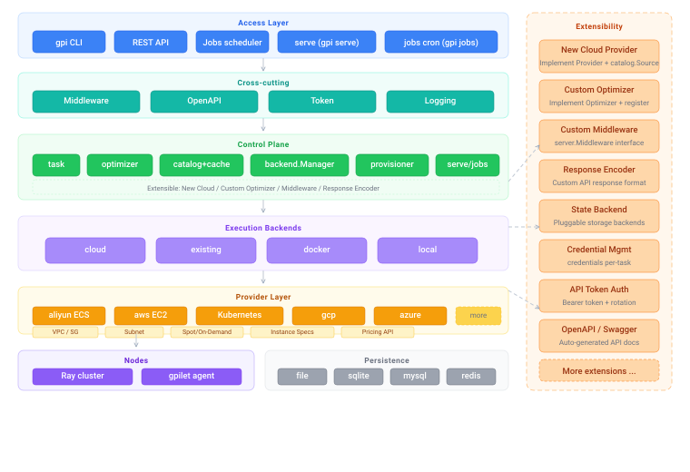

# Gpi Architecture Design Document

- **Doc version**: v71 (2026-08-17)
- **module**: `github.com/acmestack/gpi`
- **CLI**: `gpi` (binary `cmd/gpi`)
- **Goal**: Following the SkyPilot model, build multi-cloud compute scheduler in Go, matching SkyPilot's launcher / optimizer / SkyServe / Sky Jobs / API server.

## 1. Positioning

| SkyPilot capability | Gpi counterpart | Description |
|---|---|---|
| `sky launch` / `sky exec` | `gpi launch` / `gpi exec` | Task YAML → scheduling → provisioning → setup/run → log streaming |
| Optimizer (pick cheapest cloud/region) | `internal/optimizer` | Pluggable Optimizer interface, default `cost` (based on SkyPilot's single-task algorithm), built on real-time metadata + resource matching, outputs failover candidate ordering |
| Catalog (instance specs) | `internal/cloud/catalog` | Metadata contract (counterpart of `sky/catalogs`): `Source` interface + `Instance`/`Price` types + registry, no static data; TTL Cache runtime lives in `internal/metacache` |
| Pricing (real-time prices) | `catalog.Source.FetchPrices` | Merged into the catalog contract; prices refresh per cloud TTL (default 10min); `PricesForced` force-refreshes before launch |
| Cloud registration aggregation | `internal/cloud/imports` | Sole entry point for blank-importing all clouds; `gpi` and tests depend only on it; auto-generated by `gen.go` and wired as a `make build` prerequisite, so new clouds are picked up automatically at build time |
| Cloud abstractions (`sky/clouds`) | `internal/cloud` + Provider interface | One package per Provider; a single struct implements both Provider and `catalog.Source`; `cloud.Register` auto-registers the metadata source; aliyun + aws + kubernetes implemented |
| Cluster lifecycle | `gpi status/start/stop/down` | Local state storage (counterpart of `~/.sky`) |
| SkyServe | `gpi serve up/status/down` | Multi-replica service deployment across regions/clouds |
| Sky Jobs + scheduling | `gpi jobs submit/status/run` | Built-in 5-field cron + `@every/@daily` |
| HTTP API server | `gpi server start` | REST API + background job scheduler |

## 2. Architecture overview



## 3. Package layout

```
cmd/gpi/                    # CLI entry point
cmd/gpilet/                 # Node agent (skylet equivalent)
internal/
  task/                     # Task/Resources models + YAML parsing (Range, Accelerators, Credentials, Backend)
  cloud/catalog/            # Metadata contract (counterpart of sky/catalogs): Source interface + registry (specs/prices/regions)
  metacache/                # Metadata TTL cache runtime (reads catalog.Source)
  optimizer/                # Launch candidate generation: Optimizer interface + registry, default cost (match + cost ascending + failover)
  cloud/                    # Provider interface + registry
    aliyun/                 # Aliyun: lightweight RPC signing client + ECS/VPC/SG
    aws/                    # AWS: SigV4 signing client + EC2/VPC/Subnet/SG
    kubernetes/             # Kubernetes: kubeconfig context as region, Pod as instance
  backend/                  # Execution backend abstraction: cloud / existing / docker / local + Manager dispatch
  provisioner/              # launch/waitReady/runTask/exec/down/stop/start (SSH + Ray + gpilet)
  gpilet/                   # Node metric collection (CPU/memory/disk/GPU/Ray)
  state/                    # clusters/services/jobs + yaml/history/events/config/tokens
  serve/                    # Multi-replica service + endpoints (SkyServe equivalent)
  jobs/                     # Task registration, retry, cron parsing, scheduling
  server/                   # REST API + background scheduler + Middleware + OpenAPI
  logging/                  # structured logging (zap) dual-channel: diagnostic logs + CLI output
  cli/                      # cobra commands
```

## 4. Core models (internal/task)

- `Range`: supports `4` (exact), `8+` (lower bound), `-8` (upper bound), `4-8` (interval).
- `Accelerators`: `map[string]int`, supports `A100`, `A100:4`, `A100:4,V100`, list and map forms.
- `Resources`: cloud/region/zone/instance_type/cpus/memory/disk_size/accelerators/use_spot/labels/ordered.
  - **`ordered` (failover candidates)**: optional `[]*Resources`, mirroring SkyPilot `resources.ordered` — outer fields act as defaults for all candidates, entries override the defaults; the optimizer generates candidates for each group in order and concatenates them into a failover Plan (the first group ranks first, followed by the rest). When unspecified, only this group's resources are used.
- `Task`: name/num_nodes/resources/workdir/file_mounts/setup/run/envs/service.
- `ServiceSpec`: replicas/port/run/health_check, etc. (for serve).

## 5. Catalog & Optimizer

- Instance matching rules: instance_type exact, cpus exact or interval, memory exact or interval, disk_size lower bound (satisfiable as long as met), accelerators count ≥ requirement (within a single instance).
- **Fully dynamic metadata, no static data**: both specs and prices are "periodically-read metadata". The contract (`Source` interface + `Instance`/`Price` types + registry) lives in `internal/cloud/catalog` (counterpart of SkyPilot `sky/catalogs`), while the TTL cache runtime is independent in `internal/metacache`, read uniformly by the Optimizer and other callers.
- **`catalog.Source` interface**: `Cloud()` / `SpecsTTL()` / `PriceTTL()` / `Regions(ctx)` / `FetchSpecs(ctx, region)` / `FetchPrices(ctx, region, types)`. A cloud provider's `init()` only needs `cloud.Register(Provider{})` — `cloud.Register` uses type assertion to automatically register any provider satisfying `catalog.Source` as a metadata source (the aggregation package `internal/cloud/imports` mounts them all uniformly).
- **TTL cache policy (`metacache`)**: specs default 24h (low price variance), prices default 10min, each cloud can customize via `SpecsTTL()/PriceTTL()`. On fetch failure old data is retained without error (stale-while-error); `PricesForced` bypasses TTL for a forced refresh (used before launch confirmation), with a 5s cooldown on failure.
- **Pluggable Optimizer + strategies**: `optimizer.Optimizer` interface (`Name()` + `Optimize(ctx, *Request) (*Plan, error)`) + registry. `Request` contains only task resources and `Options` — **metadata is globally unique**, internally all go through the unexported `defaultMeta` (`metacache.Cache`); tests/extensions inject via `SetDefaultMeta`; the exported convenience `PricesForced` force-refreshes prices when needed. `Plan` is the failover ordering. Extension algorithms are defined by the extender; `gpi` only contracts the required inputs/outputs.
 - **Extending the Optimizer (public API)**: `Optimizer`/`Metric`/`Candidate`/`RegisterMetric`/`ParseStrategy`/`NewStrategy`/`SetDefaultMeta` are exported. Third parties only need to: ① implement `Metric` (`Name()` + `Rank(c *Candidate, useSpot)`, e.g. latency/carbon); ② call `RegisterMetric("latency", latencyMetric{})` or `NewStrategy(latencyMetric{}, costMetric{})`. Candidate collection and price fetching are done internally by the strategy optimizer, no need for the extender to reimplement. The optimizer package is split by responsibility: `optimizer.go` (`Optimizer` interface + `Get`/`Resolve` resolution entry), `plan.go` (Launch/Plan), `request.go` (Options/Request), `meta.go` (Meta interface + defaultMeta), `registry.go` (named registry), `candidate.go` (candidates + pipeline), `metric.go` (Metric interface + registration), `lexicographic.go` (`lexicographicOptimizer` lexicographic ordering), `strategy.go` (`NewStrategy`/`ParseStrategy`), `cost.go` (cost metric), `time.go` (time metric). See `optimizer_ext_test.go` (external-package test doubling as an extension example) and [gpi-optimizer-extension.md](gpi-optimizer-extension.md) (full extension guide).
- **Two selection modes**:
  - **Specify an optimizer**: `--optimizer cost|time` — single objective (cost is default: candidate set → ascending `$/hr`; time: ascending estimated runtime, outputs EST TIME column).
  - **Specify an optimization strategy**: `--optimizer <obj1>,<obj2>,...` — **lexicographic multi-objective** (based on SkyPilot's composite-optimization idea), e.g. `cost,time` (sort by cost first, tie-broken by time), `time,cost` (sort by time first, tie-broken by cost); priority can be arbitrarily combined/repeated. The API request body `optimizer` field works the same way (launch / service up).
- **Metrics (Metric)**: `cost` (`$/hr`) and `time` (estimated runtime). Runtime estimation: if the task sets `resources.time_sec` explicitly it is used (mirroring SkyPilot `set_time_estimator`); otherwise a heuristic based on instance compute power (`est = 4h / (vcpus + GPU×16)`, baseline 4 vcpus no GPU ≈ 1h, faster as compute power grows). The shared candidate pipeline (collection + price-fetch budget + price attachment) runs only once; only the sort key differs.
- **Price-fetch budget**: a single region can offer thousands of instance types (e.g. aliyun cn-hangzhou ~1956). The optimizer first pre-sorts candidates by a spec proxy (vcpu ascending) and truncates to `maxPricedCandidates` (200), then fetch prices for this batch **concurrently** (`priceWorkers=8` per cloud), avoiding serial API calls for every candidate.
- **Missing-price fallback & ordering**: candidates without a price (cost=0) are always ranked after priced candidates, never masquerading as "cheapest"; sorting and display uniformly use `Launch.CostPerHour()` — in spot mode a missing price is estimated as on-demand×0.3, in on-demand mode as spot×3.
- `Plan.Launches` is the failover order; use `--cloud` (comma-separated) / `-r REGION` / `--spot` / `--optimizer` to narrow candidates or switch algorithms. When `cloud` is unspecified, **all registered clouds** are traversed for cross-cloud price comparison by default.
- **Forced refresh before launch**: before `gpi launch` confirmation, `PricesForced` refreshes the chosen best instance type in real time (bypassing TTL), printing the latest on-demand/spot price for confirmation and avoiding underestimation by the cache.
- aliyun metadata source: `DescribeInstanceTypes` (paginated, full region specs) + `DescribePrice` (on-demand) + `DescribeSpotPriceHistory` (spot); price queries are concurrent.
- aws metadata source: `DescribeInstanceTypes` (global) + `DescribeInstanceTypeOfferings` (filtered by region, on sale) + Pricing API `GetProducts` (on-demand) + EC2 `DescribeSpotPriceHistory` (spot); price queries are concurrent.

## 6. Cloud Provider interface (internal/cloud)

```go
type Provider interface {
    Name() string
    Regions(ctx) ([]string, error)
    RunInstances(ctx, *LaunchSpec) ([]*Instance, error)
    ListInstances / DescribeInstances(ctx, region, ids) ([]*Instance, error)
    StopInstances / StartInstances / TerminateInstances
    GetPublicIP
    DescribeZones
    CreateKeyPair / DeleteKeyPair
    CreateSecurityGroup / AuthorizeSecurityGroup
    CreateVPC / CreateVSwitch / ListVSwitches
    GetImage(ctx, region, platform) (string, error)
}
```

If a Provider also implements `catalog.Source` (the metadata contract, see §5), `cloud.Register` automatically registers it as a metadata source — one struct implements everything, zero extra registration for new clouds.

Caching ensures idempotency: `RunInstances` internally fills in ImageID, SecurityGroup, VSwitch automatically; the KeyPair's private key is saved locally by the provisioner. **Reuse semantics (based on SkyPilot)**: `RunInstances` first lists existing instances by cluster name — reuses directly if running instances suffice, calls `StartInstances` to restart stopped ones (when `ResumeStoppedNodes`) for reuse, and only otherwise creates new ones.

## 7. Aliyun provider implementation

- No official SDK; RPC-style signing is implemented with the standard library (HMAC-SHA1 + SHA1Base64).
- Credentials: env vars `ALIBABA_CLOUD_ACCESS_KEY_ID/SECRET` or `~/.aliyun/config.json`.
- Endpoint: `ecs.aliyuncs.com` (overridable via `ALIBABA_CLOUD_ENDPOINT`).
- Implemented: DescribeRegions/Zones/Instances, RunInstances (Amount/Spot/Tags/UserData/ClientToken), Start/Stop/DeleteInstance, VPC/VSwitch/SG creation and authorization, CreateKeyPair, DescribeImages (auto-picks the latest public image per platform).

## 7.1 AWS provider implementation

- No official SDK; SigV4 (AWS4-HMAC-SHA256) signing is implemented with the standard library, Query API talking directly to EC2.
- Credentials: env vars `AWS_ACCESS_KEY_ID/SECRET_ACCESS_KEY`, `AWS_REGION`; or `~/.aws/credentials` (supports `AWS_PROFILE`) and `~/.aws/config` region.
- Endpoint: `https://ec2.{region}.amazonaws.com`.
- Implemented: DescribeRegions/AvailabilityZones/Instances (with NextToken pagination), RunInstances (Min/MaxCount, spot market, BlockDevice disks, TagSpecifications, ClientToken, UserData), Start/Stop/Terminate, full VPC/IGW/RouteTable/Route/Subnet creation, automatic reuse of default VPC, SG creation and Ingress authorization, CreateKeyPair, DescribeImages (Canonical Ubuntu AMI, newest x86_64 by CreationDate).

## 7.2 Kubernetes provider implementation

- Following SkyPilot's `sky/clouds/kubernetes.py` pattern, Kubernetes is implemented as a `cloud.Provider` at the same level as aliyun/aws.
- **Concept mapping**: kubeconfig context = Region, Pod = Instance, Namespace = VPC, container image = Image.
- **Virtual instance types**: `{cpus}CPU--{memGB}GB` or `{cpus}CPU--{memGB}GB--{gpu}:{count}` (e.g., `4CPU--16GB--H100:1`).
- **GPU detection**: Scans node labels, auto-matches GKE/GFD/Karpenter/CoreWeave/SkyPilot formats, generates nodeAffinity injected into pod spec.
- **SkyPilot-style bootstrap**: each node pod's start command automatically launches **gpilet** (`nohup gpilet serve` daemon writing `/var/lib/gpilet/status.json`) and **Ray** — the head runs `ray start --head` (port 6379, dashboard 8265, bound to its own pod IP), workers run `ray start --address=<head_pod_ip>:6379` (with retry). Multi-node creation is **sequential**: head is created first, waits for its pod IP, then workers are created with the head address injected. Env vars `GPI_ROLE`/`GPI_POD_IP` (downward API)/`GPI_HEAD_ADDR` are injected.
- **Default image**: `GetImage` returns the prebuilt `ghcr.io/acmestack/gpi-base:latest` (see `Dockerfile.gpi-base`, based on `rayproject/ray` with the gpilet binary baked in); overridable via the `kubernetes.image` config key.
- **Pod lifecycle**: `RunInstances` creates pods (with GPU resource request + nodeAffinity), `TerminateInstances` force-deletes (gracePeriod=0).
- **Metadata**: `FetchSpecs` dynamically queries node allocatable resources, `FetchPrices` returns $0 (self-hosted clusters have no billing).
- **No-op methods**: `CreateKeyPair`/`DeleteKeyPair` (uses RBAC), `StopInstances`/`StartInstances` (pods cannot be stopped), `CreateVSwitch`/`ListVSwitches` (K8s networking is automatic).
- **kubernetes config section** (`$GPI_HOME/config.yaml` or project `.gpi.yaml`): `kubernetes: { context, namespace, image, gpilet_dir, gpilet_interval, ray_head_port, ray_dashboard_port, pod_wait_timeout, pod_wait_retries }`, see `examples/gpi-config.yaml`.
- **Node readiness wait**: `RunInstances` waits `pod_wait_retries` attempts of `pod_wait_timeout` seconds each for a pod to reach Running (default 3×120s); slow image pulls don't fail outright — only when retries are exhausted does it fail, cleaning up created pods.
- Dependencies: `k8s.io/client-go`, `k8s.io/api`, `k8s.io/apimachinery`.

## 8. Provisioner flow & Ray cluster

1. `Launch`: ensure KeyPair → GetImage → RunInstances (UserData writes bootstrap) → write state (provisioning) → poll until Running and backfill Public/Private IPs → mark node roles.
2. **Ray bootstrap (when `num_nodes>1`)**: the head node installs `ray` and runs `ray start --head` (listening on 6379, dashboard 8265, announced with the private IP); each worker installs `ray` in parallel then runs `ray start --address=<head_private_ip>:6379` to join the cluster → state up.
3. **gpilet deployment**: after launch, upload the `gpilet` agent binary to every node and start it (`gpilet serve` periodically writes `/var/lib/gpilet/status.json`); silently skipped when the gpilet binary is not found locally. `gpi cluster nodes C --health` reads real-time health over SSH.
4. Node roles: `num_nodes=1` single node has no role; `num_nodes>1` — the 1st node is head(master), the rest are workers.
5. `RunTask`: wait for all nodes SSH-reachable → optionally rsync workdir (to head) → setup runs **in parallel on all nodes** (multi-node) → run executes on **head** (mirroring `ray exec`), line-level streaming output.
6. **Tags (cloud tags + Ray node labels)**: for clouds, tags and labels are essentially the same (both instance key-value labels), so they are **merged** and written to the cloud instance (`LaunchSpec.Tags`, coexisting with the built-in `gpi:cluster`/`gpi:cloud`); on conflict top-level `tags:` wins. In addition to being written to the cloud instance, `resources.labels:` are injected into head and all workers via `ray start --labels='{"k":"v"}'` for Ray scheduling (`ray.util` label-based placement).
 7. **Dynamic AK/SK (credentials)**: the task YAML top-level `credentials:` (a cloud-agnostic generic map `credentials: { <cloud>: { access_key_id, secret_access_key, region } }`, reusable by any cloud without adding types in the task package) provides per-task AccessKey/Secret; if provided, this launch and subsequent down/stop/start reuse those credentials, otherwise it falls back to existing env/disk default loading (`LoadCredentials`). Credentials are persisted to cluster state (`state.CloudCreds`) for lifecycle operations.
8. `Exec`: runs arbitrary commands on the head node.
9. `Down/Stop/Start`: calls cloud-side APIs (reusing the credentials from cluster creation) and syncs local state.

> Dependency injection: within a task `run`, `{{cluster.head_ip}}` (head private IP) and `{{cluster.num_workers}}` can be used to compose distributed-training arguments; see `examples/yaml/distributed-train.yaml`. A credentials example is in `examples/yaml/with-credentials.yaml`. Cluster state/topology can be inspected with `gpi cluster status|nodes` (including labels/tags).

## 8.1 Execution backends (internal/backend)

Mirrors SkyPilot's backend layer: abstracts "how a task runs", not "where state is stored". The `backend.Backend` interface defines Launch/RunTask/Exec/Down/Stop/Start; `backend.Manager` selects the backend by `task.Backend` at launch and persists the backend name to the cluster; subsequent lifecycle operations dispatch by `cluster.Backend`.

| backend | Description | Task YAML | Lifecycle |
|---|---|---|---|
| `cloud` (default) | Cloud VM + Ray/gpilet (the former provisioner) | none | fully supported |
| `existing` | Attach existing hosts, run setup/run over SSH, no provisioning | `ssh: {host, user, key, port}` | down=delete record only; stop/start not supported |
| `docker` | Run in local Docker containers | `docker: {image, volumes, envs, gpus}` | down=delete container; stop/start=stop/start container |
| `local` | Run setup/run directly on this machine | none | down=delete record only; stop/start not supported |

- Non-cloud backends skip the optimizer (no placement); `gpi launch` executes directly.
- Examples: `examples/yaml/existing-cluster.yaml`, `examples/yaml/docker-task.yaml`, `examples/yaml/local-task.yaml`.

## 9. State storage (internal/state)

- Pluggable persistence backends, selected by configuration: **file** (default), **sqlite**, **mysql**, **redis**.
- Abstracted as the `state.Backend` interface (Load/Save/Close); `Store` is an in-memory cache with full rewrite on every change.
- Configuration (env vars):
  - `GPI_STATE_BACKEND`: `file` | `sqlite` | `mysql` | `redis` (default `file`)
  - `GPI_STATE_SQLITE`: sqlite database path (default `$GPI_HOME/gpi.db`)
  - `GPI_STATE_MYSQL_DSN`: MySQL data source, e.g. `user:pass@tcp(host:3306)/gpi`
  - `GPI_STATE_REDIS_ADDR`: Redis address (default `localhost:6379`)
  - `GPI_STATE_REDIS_PASSWORD`: Redis password (optional)
  - `GPI_STATE_REDIS_DB`: Redis logical database (default 0)
- **file**: one JSON file per data kind, atomic writes (tmp+rename), default `~/.gpi/` (overridable via `GPI_HOME`):
  - `state.json` (clusters), `state-services.json`, `state-jobs.json`, `state-cluster-yaml.json`, `state-cluster-history.json`, `state-cluster-events.json`, `state-config.json`, `state-tokens.json`
- **redis**: one key per data kind (`gpi:clusters`/`gpi:services`/`gpi:jobs`/`gpi:cluster_yaml`/`gpi:cluster_history`/`gpi:cluster_events`/`gpi:config`/`gpi:tokens`), JSON blobs, atomic SET/GET writes, semantics identical to file's per-file split.
- **sqlite / mysql**: one table per entity, following SkyPilot's per-entity table approach. See the full table schema in §9.0 below.

### 9.0 Database schema (sqlite / mysql)

The SQL backend (`internal/state/sql.go`) splits tables by entity. Design principles: **explicit primary keys + indexes on common query/filter columns + rich content in `data`/`Text` JSON columns** (aligned with SkyPilot's spot / job_info / job_events). Timestamps are always `BIGINT` (Unix seconds).

| Table | Primary key | Columns (type / constraint) | Description |
|---|---|---|---|
| `clusters` | `name` | `status`(VARCHAR64), `backend`(VARCHAR32), `cloud`(VARCHAR64), `region`(VARCHAR64), `num_nodes`(INTEGER DEFAULT 0), `task_yaml`(MEDIUMTEXT), `data`(MEDIUMTEXT NOT NULL), `created_at`/`updated_at`(BIGINT NOT NULL) | Cluster records; `data` is the full `state.Cluster` JSON (instances/tags/labels/network fields, etc.) |
| `services` | `name` | `status`(VARCHAR64), `replicas`(INTEGER DEFAULT 0), `port`(INTEGER DEFAULT 0), `data`(MEDIUMTEXT NOT NULL), `created_at`/`updated_at`(BIGINT NOT NULL) | Service deployments (SkyServe counterpart); `data` is `state.Service` JSON |
| `jobs` | `name` | `status`(VARCHAR64), `schedule`(VARCHAR255), `run_count`(INTEGER DEFAULT 0), `fail_count`(INTEGER DEFAULT 0), `next_run`(BIGINT DEFAULT 0), `data`(MEDIUMTEXT NOT NULL), `created_at`/`updated_at`(BIGINT NOT NULL) | Scheduled/one-off tasks (Sky Jobs counterpart); `data` is `state.Job` JSON |
| `cluster_yaml` | `cluster_name` | `yaml`(MEDIUMTEXT NOT NULL), `created_at`/`updated_at`(BIGINT NOT NULL) | Cluster task YAML snapshot (written at launch, allows exact configuration replay) |
| `cluster_history` | `cluster_name` | `num_nodes`(INTEGER DEFAULT 0), `cloud`(VARCHAR64), `region`(VARCHAR64), `zone`(VARCHAR64), `instance_type`(VARCHAR64), `backend`(VARCHAR32), `task_yaml`(MEDIUMTEXT), `launched_at`(BIGINT DEFAULT 0), `created_at`/`updated_at`(BIGINT NOT NULL) | Cluster launch facts (retained after down, for cost/usage statistics) |
| `cluster_events` | — (no explicit PK, append-only) | `cluster_name`(VARCHAR255), `starting_status`(VARCHAR64), `ending_status`(VARCHAR64), `reason`(MEDIUMTEXT), `type`(VARCHAR32), `request_id`(VARCHAR255), `transitioned_at`(BIGINT NOT NULL) | Lifecycle event stream (launch/stop/start/down/status_change); `request_id` is passed through for traceability |
| `config` | `config_key` | `config_value`(MEDIUMTEXT NOT NULL), `created_at`/`updated_at`(BIGINT NOT NULL) | Runtime KV configuration (shared across server instances; belongs to `internal/state`, unrelated to `internal/config` file config, see §9.1.1) |
| `service_account_tokens` | `token_id` | `token_name`(VARCHAR255), `token_hash`(VARCHAR255 NOT NULL UNIQUE), `created_at`(BIGINT NOT NULL), `last_used_at`(BIGINT DEFAULT 0), `expires_at`(BIGINT DEFAULT 0), `creator`(VARCHAR255) | API access tokens; only sha256 hashes stored, `token_hash` uniquely indexed; expiry/revocation (revoke=delete row) |

DDL (the `CREATE TABLE IF NOT EXISTS` statements actually executed by `ensureTables`):

```sql
CREATE TABLE IF NOT EXISTS clusters (
    name VARCHAR(255) NOT NULL,
    status VARCHAR(64),
    backend VARCHAR(32),
    cloud VARCHAR(64),
    region VARCHAR(64),
    num_nodes INTEGER NOT NULL DEFAULT 0,
    task_yaml MEDIUMTEXT,
    data MEDIUMTEXT NOT NULL,
    created_at BIGINT NOT NULL,
    updated_at BIGINT NOT NULL,
    PRIMARY KEY (name)
);
CREATE TABLE IF NOT EXISTS services (
    name VARCHAR(255) NOT NULL,
    status VARCHAR(64),
    replicas INTEGER NOT NULL DEFAULT 0,
    port INTEGER NOT NULL DEFAULT 0,
    data MEDIUMTEXT NOT NULL,
    created_at BIGINT NOT NULL,
    updated_at BIGINT NOT NULL,
    PRIMARY KEY (name)
);
CREATE TABLE IF NOT EXISTS jobs (
    name VARCHAR(255) NOT NULL,
    status VARCHAR(64),
    schedule VARCHAR(255),
    run_count INTEGER NOT NULL DEFAULT 0,
    fail_count INTEGER NOT NULL DEFAULT 0,
    next_run BIGINT NOT NULL DEFAULT 0,
    data MEDIUMTEXT NOT NULL,
    created_at BIGINT NOT NULL,
    updated_at BIGINT NOT NULL,
    PRIMARY KEY (name)
);
CREATE TABLE IF NOT EXISTS cluster_yaml (
    cluster_name VARCHAR(255) NOT NULL,
    yaml MEDIUMTEXT NOT NULL,
    created_at BIGINT NOT NULL,
    updated_at BIGINT NOT NULL,
    PRIMARY KEY (cluster_name)
);
CREATE TABLE IF NOT EXISTS cluster_history (
    cluster_name VARCHAR(255) NOT NULL,
    num_nodes INTEGER NOT NULL DEFAULT 0,
    cloud VARCHAR(64),
    region VARCHAR(64),
    zone VARCHAR(64),
    instance_type VARCHAR(64),
    backend VARCHAR(32),
    task_yaml MEDIUMTEXT,
    launched_at BIGINT NOT NULL DEFAULT 0,
    created_at BIGINT NOT NULL,
    updated_at BIGINT NOT NULL,
    PRIMARY KEY (cluster_name)
);
CREATE TABLE IF NOT EXISTS cluster_events (
    cluster_name VARCHAR(255) NOT NULL,
    starting_status VARCHAR(64),
    ending_status VARCHAR(64),
    reason MEDIUMTEXT,
    type VARCHAR(32),
    request_id VARCHAR(255),
    transitioned_at BIGINT NOT NULL
);
CREATE TABLE IF NOT EXISTS config (
    config_key VARCHAR(255) NOT NULL,
    config_value MEDIUMTEXT NOT NULL,
    created_at BIGINT NOT NULL,
    updated_at BIGINT NOT NULL,
    PRIMARY KEY (config_key)
);
CREATE TABLE IF NOT EXISTS service_account_tokens (
    token_id VARCHAR(255) NOT NULL,
    token_name VARCHAR(255),
    token_hash VARCHAR(255) NOT NULL UNIQUE,
    created_at BIGINT NOT NULL,
    last_used_at BIGINT NOT NULL DEFAULT 0,
    expires_at BIGINT NOT NULL DEFAULT 0,
    creator VARCHAR(255),
    PRIMARY KEY (token_id)
);
```

- **file / redis backend mapping**: each sqlite/mysql table corresponds to a `state-<table>.json` file in the file backend and a `gpi:<table>` key in the redis backend (see the file/redis lists above), with identical semantics.
- Record entry points are unified in `backend.Manager.Launch` (yaml+history+launch event); `Down/Stop/Start` write events. Inspect via: `gpi cluster yaml|history|events C`.
- **API auth**: with `gpi server start --require-auth`, every request must carry `Authorization: Bearer <token>` except `/healthz` and `POST /api/v1/gpi/tokens` (bootstrapping the first token); the server looks up `service_account_tokens` by sha256 and validates valid/not-expired/not-revoked. Token management: `gpi server token create|list|revoke|rotate`.

## 9.1 User configuration (internal/config)

Mirrors SkyPilot `~/.sky/config.yaml`: user-level `$GPI_HOME/config.yaml` (default `~/.gpi/config.yaml`) and project-level `.gpi.yaml` (in the working directory) are layered and merged (project overrides user); the result is cached until process exit. **Priority: CLI flag > task YAML > config file > built-in default** — an explicitly passed flag wins; config only serves as a persistent default.

- **Cloud-specific config is defined by each cloud itself**: `internal/config` is **cloud-agnostic** and keeps only generic fields (`allowed_clouds`/`region`/`zone`/`use_spot`); each cloud's config struct (`Config`, yaml tags corresponding to `aws.*`/`aliyun.*`) lives in that cloud's own `config.go`, decoded via `config.Load().Section(cloudName, &cfg)`. **Adding a new cloud requires zero changes to `internal/config`**.
- **Cloud network reuse (the core of this release)**: when resolving networking in `RunInstances`, providers first read their own config section; on a hit they reuse existing resources, otherwise they fall back to the existing automatic logic:
  - aws: `LoadConfig()` reads `aws.vpc_names` / `aws.subnet_names` (matched by Name tag or id), `aws.security_group_name` (reused by name or id, no longer auto-creates `gpi-sg`).
  - aliyun: `LoadConfig()` reads `aliyun.vpc_id` / `aliyun.vswitch_ids` / `aliyun.security_group_id` (reused by id).
- **Global defaults**: `allowed_clouds` (default cloud filter), `region` / `zone` / `use_spot` (defaults used when `gpi launch`/`optimize` flags are not explicitly given).
- Config example at `examples/gpi-config.yaml`.

### 9.1.1 The two "config"s

gpi has **two completely different `config`s** — same name but unrelated responsibilities, lifecycles and read/write parties; do not confuse them:

| | **File config** (`internal/config` package) | **Runtime config** (`internal/state`'s `config` table) |
|---|---|---|
| Storage | `$GPI_HOME/config.yaml` + project `.gpi.yaml` (YAML files) | state backend: `state-config.json` / sqlite/mysql table `config` / redis key `gpi:config` |
| Reader | gpi **client process** (CLI / provider), single machine | Shared by **server instances** (every server reads the same copy) |
| Writer | hand-written YAML by user/project | REST `PUT /api/v1/gpi/config/{key}` |
| Access | `config.Load()` → `Section(name, &cfg)`, in-process cache | `Store.GetConfig/SetConfig/ListConfig` |
| Structure | nested YAML, generic fields + strongly-typed cloud sections (aws/aliyun each have their own `Config` struct) | flat KV (`map[key]string`), unstructured |
| Semantics | **per-machine/per-project startup preferences** (VPC/subnet/security-group reuse, region/zone/spot defaults) | **cross-instance consistent runtime switches** (e.g. a global default autostop) |
| Priority | CLI flag > task YAML > file config > built-in default | unrelated to the startup flow; read at server runtime |
| Current consumers | CLI + each cloud provider (core) | **zero production consumers** (REST handler only; `autostop` is a test placeholder) |

> **One-liner to remember**: `internal/config` = the config file a user writes (change it to change startup behavior); `internal/state`'s `config` table = a server-side KV switch table (currently no real consumers yet; enable it when a "switch every server instance must read identically" need arises).
>
> This is also why `config.Load()` does **not** read `internal/state`'s `config` table — region/zone/spot are consumed by the single-machine CLI and go through files; a real "server-side global switch" should be read by the server from `internal/state`'s `config` table, not by letting `internal/config` touch it.

## 11.4 Middleware & OpenAPI (Swagger)

- **Middleware abstraction**: `server.Middleware` interface (`Wrap(next http.Handler) http.Handler`); `Server.AddMiddleware(...)` registers custom middleware (runs outermost, before the built-in chain). Mirrors SkyPilot's FastAPI middleware stack, making it easy for teams to add custom extensions (auth/rate-limit/tracing/metrics, etc.).
- **Built-in middleware** (order: custom → security headers → CORS → auth → request-id → logging):
  - `securityHeaders`: `X-Content-Type-Options`/`X-Frame-Options`/`Referrer-Policy`
  - `cors`: enabled with `--enable-cors`, permissive headers
  - `auth`: enabled with `--require-auth`, Bearer authentication
  - `requestID`: request-id pass-through/generation (default `x-request-id`)
  - `logging`: request method/path/duration
- **OpenAPI/Swagger**: enabled with `--docs`, provides:
  - `GET /swagger.json`: OpenAPI 3.0 spec (14 paths + launch/service-up/job/task request-body schemas, including the `optimizer` field)
  - `GET /docs`: Swagger UI
  - `GET /redoc`: ReDoc
  - docs endpoints are public (no token required) for easy API browsing.
- **Viewing online**: the latest OpenAPI spec is committed at the repo root as `openapi.json` (regenerated with `make openapi`). **GitLab's built-in OpenAPI rendering** gives an interactive UI when opening that file in the repo (no GitHub Pages needed); GitHub only does JSON highlighting — paste into [Swagger Editor](https://editor.swagger.io) for interactivity. The K8s Deployment does not enable `--docs` by default.

## 9.2 serve vs server

The two command names differ by one letter but are completely different things — **one "deploys", one "exposes an API"**:

- **`gpi serve`** = **deploy a task as a long-running service**. You have a script that runs a model and want it to become a service that always serves capability externally (multiple replicas + a fixed port); use `gpi serve up S.yaml`.
- **`gpi server`** = **start gpi's own HTTP API service**. You don't want to use the CLI but want others to call gpi over HTTP (launch tasks, inspect clusters, submit jobs...); use `gpi server start`.

| | `gpi serve` | `gpi server` |
|---|---|---|
| One-liner | "turn my task into a service" | "turn gpi into an HTTP-callable service" |
| Serves whom | your **task** (model/script) | **gpi itself** (control-plane API) |
| Commands | `gpi serve up/status/down S.yaml` | `gpi server start`, `gpi server token ...` |
| Output | `state.Service`: multi-replica cluster + port + access endpoint | HTTP endpoints `/api/v1/gpi/...` |
| Long-running in background? | replicas are long-running | yes, one API process + job scheduler |

**Example: deploying an LLM service**

```yaml
# llm-service.yaml
service:
  replicas: 2
  port: 8000
resources:
  accelerators: A100:1
run: python serve_llm.py
```

```bash
# ① serve: deploy the task above as a long-running 2-replica service
gpi serve up llm-service.yaml

# ② server: if you want to manage this gpi instance over HTTP (instead of the CLI)
gpi server start
```

**How they relate (call chain)**

```
HTTP caller
    │  curl -X POST /api/v1/gpi/services/up   ← API provided by server
    ▼
gpi server (internal/server) — parses HTTP, auth, routing
    │  internally calls serve.Manager.Up(...)
    ▼
gpi serve (internal/serve) — actually provisions replicas on the cloud, records Service state
```

> Mnemonic: **serve is "serve your task out" (deploy your app); server is "gpi acting as a server" (expose APIs to others)**. The former faces your business; the latter faces gpi's users.

## 10. Command reference (gpi)

| Command | Description | Counterpart |
|---|---|---|
| `gpi launch T.yaml [-c NAME] [--spot] [--optimizer cost|time|cost,time] [-y]` | Schedule + provision + run a task (multi-node auto-groups into a Ray cluster) | `sky launch` |
| `gpi optimize T.yaml [--optimizer cost|time|cost,time]` | Only print the placement plan (supports strategies, e.g. `cost,time`) | optimizer dry-run |
| `gpi status` | Cluster list (including head/worker role statistics) | `sky status` |
| `gpi cluster status\|nodes C` | Cluster topology and node role details | `ray status` equivalent |
| `gpi exec C -- CMD` | Run arbitrary commands on head | `sky exec` |
| `gpi down/stop/start C` | Lifecycle | `sky down/stop/start` |
| `gpi serve up S.yaml` / `status` / `down` | Service deployment | `sky serve up/status/down` |
| `gpi jobs submit T.yaml --schedule "0 0 * * *" --retries 3` | Register a task | `sky jobs launch` |
| `gpi jobs status` / `run` | Inspect / run immediately | `sky jobs` |
| `gpi server start --port 8080` | REST API + scheduler | sky server |

## 11. HTTP API (gpi server)

All REST routes start with the API prefix, **default `/api/v1/gpi`**, customizable via the `GPI_API_PREFIX` env var or `gpi server start --api-prefix <prefix>`. The table below shows the full paths under the default prefix.

| Method | Path | Description |
|---|---|---|
| GET | `/healthz` | Health check |
| GET | `/api/v1/gpi/clusters` | Cluster list |
| GET | `/api/v1/gpi/clusters/{name}` | Cluster details |
| POST | `/api/v1/gpi/clusters/{name}/launch` | Schedule + provision (task is a **YAML string**, supports dry_run / run_task / optimizer) |
| DELETE | `/api/v1/gpi/clusters/{name}` | Tear down |
| POST | `/api/v1/gpi/tasks/{name}/launch` | Schedule + provision (task is **Task struct JSON**, distinct from the path above) |
| GET | `/api/v1/gpi/services` | Service list |
| POST | `/api/v1/gpi/services/up` | Deploy a service (supports optimizer) |
| DELETE | `/api/v1/gpi/services/{name}` | Remove a service |
| GET | `/api/v1/gpi/jobs` | Task list |
| POST | `/api/v1/gpi/jobs` | Register a task |
| POST | `/api/v1/gpi/jobs/{name}/run` | Run immediately |

The background scheduler scans for due tasks every 10s (NextRun derived from cron parsing) and recomputes the next trigger time after each successful/failed run.

`POST /api/v1/gpi/clusters/{name}/launch` and `POST /api/v1/gpi/services/up` request bodies support the `optimizer` field (`cost`/`time`/`cost,time`, etc.), empty defaults to `cost`, consistent with the CLI `--optimizer` semantics.

**Two ways to pass a task**:
- `clusters/{name}/launch`: the `task` in the request body is a **YAML string** (compatible with task file contents).
- `tasks/{name}/launch`: the `task` in the request body is **Task struct JSON** (structured fields, lower camelCase, e.g. `{"name":"..","numNodes":..,"resources":{"accelerators":{"A100":1},"cpus":"8+"},"run":".."}`); `task` is required.

### 11.1 Customizable response structure (ResponseEncoder)

Different teams have different requirements for API response wrapping; the `ResponseEncoder` interface unifies it, and `Server` selects by env var by default:

- **Configuration**: env var `GPI_RESPONSE_FORMAT=raw|envelope`, or `gpi server start --response-format raw|envelope`.
- **raw (default)**: returns data as-is on success, `{"error":"..."}` on error.
- **envelope**: uniformly wraps as `{"code":<http>,"message":"ok|err","data":<payload>}`; field names customizable via `EnvelopeConfig`.
- **Fully custom**: implement the `ResponseEncoder` interface (`EncodeSuccess/EncodeError`) and register via `Server.SetResponseEncoder(...)` to output any team-agreed structure (e.g. `{"success":true,"result":...}`).

### 11.2 Request ID

Every request is assigned a request ID for end-to-end tracing:

- **Source**: if the request header carries an upstream request ID (e.g. forwarded via other gateways/services) it is passed through as-is; otherwise a random 32-char hex ID is generated.
- **Write-back**: the ID is carried in both the response header and body (header and body values match).
- **header key**: default `x-request-id`, customizable to any valid HTTP header key via `GPI_REQUEST_ID_HEADER` or `gpi server start --request-id-header`.
- **body field name**: default `request_id` (changeable via `Server.RequestIDBodyField`). When the body is an object the field is injected directly; for other shapes such as arrays it is wrapped as `{"request_id":..., "data":...}`.
- Orthogonal to `ResponseEncoder`: regardless of raw/envelope/custom Encoder, request_id is always injected.

### 11.3 Response key style (KeyStyle)

The key naming style of response JSON is configurable, default **lower camelCase**:

- Three styles: `camel` (`numNodes`, default), `snake` (`num_nodes`), `pascal` (`NumNodes`).
- Configuration: env var `GPI_API_RESPONSE_KEY_STYLE`, or `gpi server start --api-key-style camel|snake|pascal`, or `Server.SetKeyStyle(...)`.
- Applies recursively to every key in the entire response body (struct fields, envelope fields, request_id, etc.); only changes the on-wire JSON format, handlers and internal structures stay unchanged.
- Example (envelope + default camel): `{"code":200,"message":"ok","data":[...],"requestId":"..."}`; under snake `request_id`; under pascal `RequestId`.

## 12. Dependencies

- CLI: `github.com/spf13/cobra` + `gopkg.in/yaml.v3`.
- Storage: `modernc.org/sqlite` (pure-Go sqlite), `github.com/go-sql-driver/mysql`, `github.com/redis/go-redis/v9`.
- Cloud-side, SSH and HTTP all use the standard library (aliyun/aws both use self-implemented signing).
- Testing: `github.com/alicebob/miniredis/v2` (pure-Go in-memory Redis).
- Go version ≥ 1.22 required (`net/http` routing patterns).
- **Containerization**: `Dockerfile` multi-stage build (golang build + scratch runtime), producing both `gpi` and `gpilet` binaries; `make docker` builds `gpi:latest` in one step. **Kubernetes deployment**: `deploy/k8s/` provides namespace/configmap/deployment/service/redis backend/PVC etc. resources; `kubectl apply -k deploy/k8s` deploys in one step (see [deploy/k8s/README.md](../../deploy/k8s/README.md)); the image is pushed to `ghcr.io/acmestack/gpi` by the Release workflow.

## 13. Known limitations & roadmap

- Two Providers (aliyun + aws); cloud/catalog contract + metacache provides full metadata (specs/prices fetched in real time + TTL cache). Roadmap: GPU-memory variant matching, multi-instance GPU sharding (A100:8 across nodes), spot bid-price caps, SkyServe autoscaling/health polling, job log persistence.
- Multi-node head/worker Ray clusters are supported (setup on all, run on head); future additions: precise inter-node SG rules, `ray attach`/port forwarding, GPU resource spec reporting.
- Security groups allow `0.0.0.0/0:22` and `1024-65535` by default; production needs to be tightened.
- **Platform support**: Linux and macOS only (gpilet relies on Unix APIs such as `syscall.Statfs`; `disk_unix.go` is restricted to `linux || darwin`); no Windows support.

---

## Version history

- **v71 (2026-08-17)**: Kubernetes node readiness wait made configurable — `kubernetes` config section adds `pod_wait_timeout`/`pod_wait_retries`; `RunInstances` waits retries×timeout for a pod to reach Running, failing for real (and cleaning up created pods) only after retries are exhausted; `Instance.ID` unified to pod name (PodToInstance/DescribeInstances/TerminateInstances consistent). Research confirmed SkyPilot's K8s pod readiness wait is not configurable (enhancement in gpi-enhancements §4.1). Doc bumped to v71.
- **v70 (2026-08-17)**: Kubernetes Provider enhanced — SkyPilot-style node bootstrap (pod start command auto-launches gpilet daemon + Ray: head `ray start --head`, workers join; multi-node sequential with head pod IP captured first); new `Dockerfile.gpi-base` default node image (rayproject/ray + gpilet, `ghcr.io/acmestack/gpi-base:latest`); `kubernetes` config section (context/namespace/image/gpilet/Ray ports); e2e now covers gpilet + Ray real runtime. Doc bumped to v70.
- **v67 (2026-08-15)**: Architecture diagram refined — removed Rate Limiting (unsupported by gpi); enlarged execution backend nodes for proper container proportion; enriched Cloud layer (aliyun ECS / aws EC2 / gcp(planned) / azure(planned) / more..., plus VPC/SG/Subnet/Spot/Pricing info nodes); added Nodes layer (Ray cluster + gpilet agent); Extensibility moved to right sidebar; improved color contrast (light container + saturated child nodes). Doc bumped to v67.
- **v69 (2026-08-15)**: Added Kubernetes cloud backend — following SkyPilot pattern, K8s implemented as `cloud.Provider` (same level as aliyun/aws), kubeconfig context = Region, Pod = Instance; virtual instance types `4CPU--16GB--H100:1`; automatic GPU detection (GKE/GFD/Karpenter/CoreWeave/SkyPilot label formats) + nodeAffinity; `catalog.Source` dynamically queries node resources, price = $0; new `internal/cloud/kubernetes/` package (provider/client/gpu/metadata), 9 unit tests passing. Doc bumped to v69.
- **v65 (2026-08-15)**: Replaced mermaid with SVG — overview redesigned as layered horizontal bands (eliminates line crossings), module-specific colors, rounded corners with thin strokes, containers fully enclose all nodes; added Extensibility section (New Cloud / Custom Optimizer / Custom Encoder); Cross-cutting placed right after Access layer; English version fully translated. Doc bumped to v65.
- **v63 (2026-08-15)**: Replaced mermaid diagrams with SVG (transparent background, module-specific colors, rounded corners with thin strokes, compact aligned layout) for consistent rendering and improved visual quality; synced zh/en. Doc bumped to v63.
- **v62 (2026-08-15)**: Added the `logging` cross-cutting capability node to both the overview and layered-view diagrams (structured logs + CLI output dual channel); added `internal/logging` to the package layout; fixed the root README's incorrect `../` prefixes on links to `examples/`, `openapi.json`, `deploy/k8s/README.md`, `LICENSE`. Doc bumped to v62.
- **v61 (2026-08-13)**: `examples/json` naming changed to `{scene}-obj.json` (Task struct form) / `{scene}-yamlstr.json` (YAML string form); removed the dead field `Task.Time` (no business consumer; runtime estimation uses `Resources.TimeSec`); synced swagger/openapi. Doc bumped to v61.
- **v60 (2026-08-13)**: task package split — `Credentials` moved to its own `credentials.go`, sub-specs (SSHTarget/DockerSpec/ServiceSpec) to their own `spec.go`, leaving only Task and parsing methods in `task.go`; added comments to every Task field and `omitempty` to optional fields. `Range.MarshalJSON` now emits a compact string (`"8+"`/`"4-8"`), friendlier for JSON request bodies. examples split into `examples/yaml/` (task files) + `examples/json/` (API request bodies). swagger Task schema gained optional-field notes + SSHTarget/DockerSpec/ServiceSpec sub-schemas. Doc bumped to v60.
- **v59 (2026-08-13)**: task package json tags unified to **lower camelCase** (`num_nodes`→`numNodes`, etc.; yaml stays snake_case); server API DTOs (launch/taskLaunch) json tags aligned to camel to match swagger; `Credentials` gained `omitempty`. `/tasks/{name}/launch` request-body fields changed to camel. Doc bumped to v59.
- **v58 (2026-08-13)**: `task.Credentials` generalized — from a per-cloud hardcoded struct (aws/aliyun) to a cloud-agnostic generic map `credentials: { <cloud>: {...} }`; new clouds reuse it directly without touching the task package; `ForCloud`/`Validate` dropped their switch; kept backward compat with aliyun's old `access_key_secret` field. Doc bumped to v58.
- **v57 (2026-08-13)**: `Resources` gained `ordered` (failover candidates, mirroring SkyPilot `resources.ordered`) — outer fields as defaults, entries override; the optimizer generates candidates per group in order and concatenates them into a failover Plan (order preserved between groups, within-group sorted by metric). Doc bumped to v57.
- **v56 (2026-08-13)**: added §9.2 "serve vs server" — `gpi serve` (service deployment, SkyServe counterpart) vs `gpi server` (HTTP API control plane), with a comparison table and one-liner mnemonic. Doc bumped to v56.
- **v55 (2026-08-13)**: added §9.0 database schema — comparison table of all 8 sqlite/mysql tables' columns/types/constraints/primary keys + full DDL (`ensureTables`), plus file/redis mapping notes. Doc bumped to v55.
- **v54 (2026-08-13)**: added §9.1.1 "the two configs" — `internal/config` package (file config, single-machine client) vs `internal/state`'s `config` table (runtime KV, multi-instance server), with a comparison table and one-liner mnemonic, eliminating same-name confusion. Doc bumped to v54.
- **v53 (2026-08-13)**: `lexicographicOptimizer` separated into `lexicographic.go` (algorithm implementation); `strategy.go` now only holds strategy construction (`NewStrategy`/`ParseStrategy`) + built-in registration. Doc bumped to v53.
- **v52 (2026-08-13)**: optimizer naming changes — `Objective` → `Metric` (scoring metric), `costObjective`/`timeObjective` → `costMetric`/`timeMetric`, `RegisterObjective` → `RegisterMetric`, `objective.go` → `metric.go`; `strategyOptimizer` → `lexicographicOptimizer` (lexicographic multi-metric ordering); public `NewStrategy`/`ParseStrategy` kept. Doc bumped to v52.
- **v51 (2026-08-09)**: removed GitHub Pages (`.github/workflows/pages.yml`, `docs/apis/index.html`, `swagger-initializer.js`) — GitHub has no built-in OpenAPI rendering. `openapi.json` is now committed at the **repo root**, leveraging **GitLab's built-in OpenAPI viewer** for interactive online viewing. Doc bumped to v51.
- **v50 (2026-08-09)**: optimizer package re-adjusted — the `Optimizer` interface and `Get`/`Resolve` resolution entry moved back to `optimizer.go`; `registry.go` keeps only the named registry (`Register`/`Names`/`Default`/`DefaultName`). Doc bumped to v50.
- **v49 (2026-08-09)**: ①`RunInstances` changed to **list-then-reuse/restart/create** following SkyPilot — list existing instances by cluster name; reuse directly if running suffice, `StartInstances` to restart stopped ones (`ResumeStoppedNodes`), otherwise create new (aliyun + aws, `LaunchSpec.ResumeStoppedNodes`, enabled by default in the provisioner); ②optimizer package split by responsibility (plan/request/meta/registry/candidate/objective/strategy/cost/time); ③extension guide gained the "Objective vs Optimizer" distinction. Doc bumped to v49.
- **v48 (2026-08-09)**: OpenAPI online preview path changed to `https://acmestack.github.io/gpi/apis` — the Swagger UI trio (index.html/swagger-initializer.js/openapi.json) moved to `docs/apis/`; `make openapi` outputs to `docs/apis/openapi.json`. Doc bumped to v48.
- **v47 (2026-08-09)**: interactive OpenAPI online preview — `docs/index.html` + `swagger-initializer.js` (Swagger UI loading `./openapi.json`) + `.github/workflows/pages.yml` (GitHub Pages publishing `docs/`); visit `https://acmestack.github.io/gpi/apis` for interactive viewing (GitLab has built-in OpenAPI preview; GitHub uses Pages equivalently). Doc bumped to v47.
- **v46 (2026-08-09)**: OpenAPI online viewing — `cmd/gen-openapi` + `make openapi` generates the latest `docs/openapi.json` committed to the repo; view directly on the GitHub web UI without starting the service; the K8s Deployment does **not** enable `--docs` by default (Swagger UI is not exposed with the service). Doc bumped to v46.
- **v45 (2026-08-09)**: added Kubernetes deployment resources `deploy/k8s/` — namespace / configmap / deployment (with probes and resource limits) / service / redis backend / pvc / kustomization; `kubectl apply -k deploy/k8s` deploys in one step; README gained a "deploy to K8s" section. Doc bumped to v45.
- **v44 (2026-08-09)**: ①swagger's `taskLaunchRequest.task` now references the full `Task`/`Resources` schemas (Swagger UI can expand the task structure); ②docs version format unified — version history sits under the version number at the top (descending, aligned with gpi-optimizer-extension.md); architecture version history moved from the end of the file to the top; ③fixed doc/implementation inconsistencies (`/api/v1/tokens`→`/api/v1/gpi/tokens`, README storage backends gained redis); ④added `aiagents/MEMORY.md` project communication notes, `LICENSE` (MIT), `.github/CLA.md`+`cla-assistant.json` (AcmeStack CLA). Doc bumped to v44.
- **v43 (2026-08-09)**: fixed POST having no request body in Swagger UI — the OpenAPI document is a spec, not business data, so it is now output via `writeRawJSON` (exempt from **KeyStyle**), preventing fixed keys like `requestBody` from being key-style converted (they used to become `request_body` under snake, hiding the body in the UI); schema property names unified to camelCase (`numNodes`/`useSpot`, etc.) to match the default API. Doc bumped to v43.
- **v42 (2026-08-09)**: REST API prefix is customizable — default `/api/v1/gpi` (`GPI_API_PREFIX` or `--api-prefix`); swagger shows the full path (including prefix), one-to-one with the server.go routes. Added `POST /tasks/{name}/launch`: task passed as **Task struct JSON** (distinct from `clusters/{name}/launch`'s YAML string); added JSON tags to the task struct and `Range.UnmarshalJSON` (supports `"cpus":"8+"`); extracted a shared `launchTask` pipeline reused by both paths. Doc bumped to v42.
- **v41 (2026-08-09)**: fixed Swagger `$ref` breakage under KeyStyle — `convertKeys` now synchronously converts the name in `#/components/schemas/<name>` to the current key style (camel/snake/pascal), keeping schema component keys and `$ref` references always consistent; added `TestApplyKeyStyleRewritesSchemaRef`. Under the default camel, request-body fields are lower camelCase (`numNodes`/`useSpot`, etc.), effective too with `--api-key-style snake|pascal`. Doc bumped to v41.
- **v40 (2026-08-09)**: ①`strategy.go`'s `init` moved to the end of the file; ②CI/Release workflows gained Docker image builds (CI builds for verification, Release pushes to GHCR `ghcr.io/<owner>/gpi`); ③doc versioning rules moved from each doc into the repo-root `AGENTS.md` (long-lived docs follow the "version recorded in content" convention; one-off artifacts still use `-vN-YYYYMMDD` naming); ④Swagger gained request-body schemas (launch/service-up/job submit/run, including the `optimizer` field). Doc bumped to v40.
- **v39 (2026-08-09)**: time and cost made symmetric — `timeObjective` moved into `time.go` with new explicit `OptimizeByTime`/`OptimizeByTimeContext`; `NewStrategy`/`ParseStrategy` moved to `strategy.go` (strategy construction's home); `objective.go` now only holds the `Objective` interface and the objective registry. Added `TestOptimizeByTime` verifying fastest-is-picked-first. Doc bumped to v39.
- **v38 (2026-08-09)**: the cost objective belongs to `cost.go` — `costObjective` moved in with new explicit entry points `OptimizeByCost`/`OptimizeByCostContext` ("optimize by cost" self-explanatory); `Optimize`/`OptimizeWithContext` became its aliases; added `TestOptimizeByCost` verifying cheapest-is-picked-first. Doc bumped to v38.
- **v37 (2026-08-09)**: added `docs/gpi-optimizer-extension.md` — a complete Optimizer extension guide: architecture overview, core types (Candidate/Request/Options/Plan/Meta), built-in optimizer & strategy usage, composable extension (implement `Objective` + register), full extension (implement `Optimizer`), injecting fake Meta in tests, evolution direction and a cheat sheet. Doc bumped to v37.
- **v36 (2026-08-09)**: optimizer re-consolidated — `DefaultMeta` demoted to unexported `defaultMeta`; `CollectCandidates`/`AttachPrices` pipeline no longer exported (extenders go through `Objective`, no need to reuse the pipeline); added the exported convenience `PricesForced` (for force-refreshing prices before launch); `SetDefaultMeta` kept for test/extension injection. Doc bumped to v36.
- **v35 (2026-08-09)**: optimizer internals reorganized — `Candidate`/`CollectCandidates`/`AttachPrices` moved to `candidate.go` (pipeline's home), the `Objective` interface and built-in objectives moved to `objective.go`, and `strategy.go` now focuses on strategy ordering with comments added to each `Optimize` step. `Objective.Rank` renamed (formerly `Score`; clearer semantics: "the rank score given to a candidate"). `Request.Meta` fully removed — globally-unique metadata goes through `DefaultMeta`, tests inject via `SetDefaultMeta`. `RegisterObjective` simplified (pass the instance directly, no constructor). Doc bumped to v35.
- **v34 (2026-08-09)**: optimizer **extension API opened** — `Optimizer`/`Objective`/`Candidate`/`RegisterObjective`/`ParseStrategy`/`NewStrategy`/`CollectCandidates`/`AttachPrices` all exported; third parties can implement custom objectives (latency/carbon, etc.) and register them into strategies or reuse the candidate pipeline directly (the external-package test `optimizer_ext_test.go` is the example). `Request.Meta` became optional (empty auto-uses `DefaultMeta`). **API supports optimizer/strategy**: launch / service up request bodies gained the `optimizer` field. Fixed a parallel-array sort bug (`sort.SliceStable` reordered cands without syncing scores, scrambling cost/time ordering) by sorting a `{candidate, scores}` struct together + a regression test. Doc bumped to v34.
- **v33 (2026-08-09)**: Optimizer supports **two selection modes** — specify an optimizer (`cost`/`time` single objective) and specify an optimization strategy (`--optimizer cost,time` etc., comma-separated **lexicographic multi-objective**, based on SkyPilot's composite-optimization idea; priorities arbitrarily combined/repeated). Extracted the `Objective` interface (`cost`/`time`) and a shared candidate pipeline (collection + price-fetch budget + price attachment run once, only the sort key differs); `strategyOptimizer` sorts lexicographically by objective priority; `Get(name)` auto-resolves comma-separated strategy names. Doc bumped to v33.
- **v32 (2026-08-09)**: added the `time` optimizer (reference SkyPilot `OptimizeTarget.TIME`, `--optimizer time`): ascending estimated runtime, outputs an EST TIME column. Runtime estimation: if the task sets `resources.time_sec` explicitly it is used (mirroring SkyPilot `set_time_estimator`); otherwise a compute-power heuristic (`est = 4h / (vcpus + GPU×16)`, baseline 4 vcpus no GPU ≈ 1h, faster as compute power grows); reuses cost's candidate set/price attachment and price-fetch budget. `Launch.EstimatedTime` + `Plan.TotalEstimatedTime` carry the display. Doc bumped to v32.
- **v31 (2026-08-09)**: contract vs cache-runtime split finalized — `internal/cloud/catalog` keeps only the **contract** (`Source` interface + `Instance`/`Price` types + registry, corresponding to SkyPilot `sky/catalogs`); the TTL **Cache runtime reverted to a standalone `internal/metacache`** (heavyweight, avoids bloating cloud/catalog). One-way dependency: `cloud ← cloud/catalog ← metacache ← optimizer`. Doc bumped to v31.
- **v30 (2026-08-09)**: catalog package kept and **sunk into `internal/cloud/catalog`** (reverting the metacache split), aligning with SkyPilot's directory mapping: `internal/cloud` ↔ `sky/clouds`, `internal/cloud/catalog` ↔ `sky/catalogs`, `internal/optimizer` ↔ `sky/optimizer`. catalog self-contains `Source` interface + `Instance`/`Price` types + registry + TTL `Cache`; `cloud.Register` type-asserts and auto-registers metadata sources. Spec type reverted from `InstanceSpec` to `catalog.Instance`. Doc bumped to v30.
- **v29 (2026-08-09)**: metadata split — `internal/catalog` deleted, contract merged into `internal/cloud` (`Source` interface + `InstanceSpec`/`Price` types + `SourceFor`/`HasSource`/`SourceNames` registry; `cloud.Register` auto-registers), TTL cache runtime standalone as `internal/metacache` (`Cache`, imports cloud). One-way dependency: `cloud ← metacache ← optimizer`; `cloud` is no longer reverse-depended on by the metadata runtime, no cycles. Spec type renamed to `InstanceSpec` (avoiding conflict with the runtime instance `cloud.Instance`). Doc bumped to v29.
- **v28 (2026-08-09)**: new clouds need only **one struct**. Cloud packages no longer define a separate `catalog.Source` implementation: the `Provider` struct implements both `cloud.Provider` and `catalog.Source` method sets; `cloud.Register(p)` type-asserts and auto-registers any provider satisfying `catalog.Source` as a metadata source (`catalog.Register`); `init()` only needs `cloud.Register` + `cloud.RegisterFactory`; deleted both clouds' `source` structs. Added the Redis state backend (`GPI_STATE_BACKEND=redis`, `GPI_STATE_REDIS_ADDR/PASSWORD/DB`, go-redis/v9, one key per data kind: `gpi:clusters`/`gpi:services`/`gpi:jobs`/`gpi:cluster_yaml`/`gpi:cluster_history`/`gpi:cluster_events`/`gpi:config`/`gpi:tokens`, semantics same as file's per-file split). Added `Dockerfile` (multi-stage build of gpi+gpilet) + `.dockerignore` + `make docker`. Doc bumped to v28.
- **v27 (2026-08-09)**: Catalog fully metadata-ized; all static `xx_data.go` removed. Each cloud implements `catalog.Source` (`SpecsTTL`/`PriceTTL` customized per cloud), `catalog.Cache` TTL caching (specs default 24h, prices default 10min, stale-while-error); the `internal/pricing` package removed, prices merged into catalog; aliyun/aws gained `metadata.go` (`DescribeInstanceTypes`/`DescribeInstanceTypeOfferings` full specs). Optimizer made pluggable: `optimizer.Optimizer` interface + registry + `--optimizer` flag; the default `cost` optimizer references SkyPilot's single-task algorithm (candidate set → scoring → sort); extenders define custom algorithms and Meta. Price fetching budgeted (candidate truncation `maxPricedCandidates=200` + concurrency `priceWorkers=8`); unpriced candidates rank after priced ones; display and ordering uniformly use `Launch.CostPerHour` fallback estimation. Fixed a pagination signature leftover (clearing `Signature` inside `call`). Doc bumped to v27.
- **v26 (2026-08-08)**: aggregation-package generation wired as a `make build` prerequisite (`generate` target); after creating a new cloud package, just `make build` auto-generates and includes it, no separate command needed; CI going through `make build` works the same. Doc bumped to v26.
- **v25 (2026-08-08)**: aggregation package now auto-generated — `gen.go` (`//go:build ignore`) scans subpackages under `internal/cloud/` containing `cloud.Register(` and rewrites `imports.go` via `go generate ./internal/cloud/imports`; run once after creating a new cloud package, zero manual import edits. Doc bumped to v25.
- **v24 (2026-08-08)**: added the aggregation package `internal/cloud/imports`; all clouds' blank imports centralized in one place; the `gpi` binary and tests import only it; new clouds just add one line to the aggregation package. Doc bumped to v24.
- **v23 (2026-08-08)**: cloud registration converged to a single entry — each cloud's `init()` in `provider.go` completes `cloud.Register`/`cloud.RegisterFactory`/`pricing.Register`/`catalog.Register` in one shot; catalog's `<cloud>Catalog` type exports are registered by the cloud package; added the `docs/gpi-new-cloud.md` onboarding guide. Doc bumped to v23.
- **v22 (2026-08-08)**: Catalog changed to static specs + real-time prices. Added `internal/pricing` (TTL cache + lazy real-time fetching, triggered by demand rather than scheduled, eliminating time skew); aliyun uses `DescribePrice`+`DescribeSpotPriceHistory`, aws uses Pricing API `GetProducts`+`DescribeSpotPriceHistory`; the optimizer overlays real-time prices before sorting; before launch confirmation `GetForced` force-refreshes the chosen best instance type, falling back to static prices on failure. Doc bumped to v22.
- **v21 (2026-08-08)**: project-wide de-rename, `gpilot → gpi`: module `github.com/acmestack/gpi`, docs `gpi-architecture.md`/`gpi-enhancements-over-skypilot.md`, titles/descriptions/logs/DB/cloud-resource names all unified to `gpi`. Doc bumped to v21.
- **v20 (2026-08-08)**: architecture diagrams upgraded to a dark theme with layered coloring (six-color classDef for access/control-plane/execution/cloud/persistence/API) and emoji icons. Doc bumped to v20.
- **v19 (2026-08-08)**: redrew the architecture diagrams (Mermaid, with execution-backend/persistence/API-capability layers) + updated the package layout. Doc bumped to v19.
- **v18 (2026-08-08)**: Middleware abstraction + OpenAPI/Swagger. `server.Middleware` interface + `AddMiddleware` for custom extensions (aligned with SkyPilot's middleware stack); built-in security-headers/CORS/auth/request-id/logging middleware; `--docs` serves `/swagger.json`, `/docs` (Swagger UI), `/redoc`. Doc bumped to v18.
- **v17 (2026-08-08)**: added the `config` (KV config) and `service_account_tokens` (API tokens) tables (aligned with SkyPilot). Added the `--require-auth` Bearer auth middleware (sha256 lookup, supports expiry/revocation/rotation), `gpi server token create|list|revoke|rotate`, and config HTTP endpoints. Doc bumped to v17.
- **v16 (2026-08-08)**: aligned with SkyPilot by adding cluster snapshot/history/events: `cluster_yaml` (task YAML snapshot), `cluster_history` (launch history), `cluster_events` (lifecycle events, including request_id); all supported by file/sqlite/mysql backends; `backend.Manager.Launch` records uniformly; added `gpi cluster yaml|history|events` commands. Doc bumped to v16.
- **v15 (2026-08-08)**: SQL backend splits tables by entity (`clusters`/`services`/`jobs`), referencing SkyPilot's table approach (explicit index columns + data JSON column). Doc bumped to v15.
- **v14 (2026-08-08)**: platform support clarified as Linux/macOS; removed the Windows cross-compile targets (CI/release workflows and gpilet build tags); no Windows support. Doc bumped to v14.
- **v13 (2026-08-08)**: response key style configurable (camel/snake/pascal, default lower camelCase). Config via `GPI_API_RESPONSE_KEY_STYLE`/`--api-key-style`/`SetKeyStyle`, applied recursively to every key in the whole response body. Doc bumped to v13.
- **v12 (2026-08-08)**: added Request ID. Each request passes through an incoming request-header ID or generates one; written back to both response header and body (header key default `x-request-id`, configurable via `GPI_REQUEST_ID_HEADER`/`--request-id-header`; body field default `request_id`). Doc bumped to v12.
- **v11 (2026-08-08)**: API response structure customizable. `server.ResponseEncoder` interface + built-in raw/envelope; selected via `GPI_RESPONSE_FORMAT` or `--response-format`; field names configurable; also supports team-custom Encoders. Doc bumped to v11.
- **v10 (2026-08-08)**: added the execution-backend abstraction (mirroring SkyPilot's backend layer). `internal/backend` defines the `Backend` interface + `Manager` dispatch; supports `cloud` (default)/`existing` (attach existing hosts over SSH)/`docker` (local containers)/`local` (run directly on this machine); non-cloud backends skip the optimizer. Doc bumped to v10.
- **v9 (2026-08-08)**: pluggable persistence. Abstracted `state.Backend`; supports file (default)/sqlite/mysql three backends, selected by the `GPI_STATE_BACKEND` config. Doc bumped to v9.
- **v8 (2026-08-08)**: added the gpilet node agent (skylet counterpart). `cmd/gpilet` + `internal/gpilet`: `gpilet serve` continuously collects CPU/memory/disk/GPU/Ray status into `/var/lib/gpilet/status.json`; Launch auto-uploads and starts it; `gpi cluster nodes C --health` reads real-time health. Doc bumped to v8.
- **v7 (2026-08-08)**: tags and labels merged. To a cloud both are instance key-value labels; now uniformly merged and written to the cloud instance (`LaunchSpec.Tags`, top-level `tags:` wins); `resources.labels:` also injected into Ray. Doc bumped to v7.
- **v6 (2026-08-08)**: per-task dynamic AK/SK supported. Task top-level `credentials:` (aws/aliyun sections) provides task-specific credentials which take precedence; otherwise fall back to env/disk default loading; credentials persisted to cluster state (`state.CloudCreds`), reused by Down/Stop/Start. Example `examples/yaml/with-credentials.yaml`. Doc bumped to v6.
- **v5 (2026-08-08)**: custom tags and labels supported. Task top-level `tags:` merged into cloud instance tags; `resources.labels:` injected via `ray start --labels` (head+worker), persisted to cluster state and shown by `gpi cluster status`. Doc bumped to v5.
- **v4 (2026-08-08)**: Ray cluster architecture completed. With `num_nodes>1` nodes carry head/worker roles; Ray is bootstrapped automatically after launch (head `ray start --head`, workers join); setup runs in parallel on all nodes, run on head; added `gpi cluster status|nodes`, role statistics in `gpi status`, and `{{cluster.head_ip}}/{{cluster.num_workers}}` injection inside tasks. Doc bumped to v4.
- **v3 (2026-08-08)**: AWS Provider implemented (`internal/cloud/aws` + `internal/catalog/aws*`). Zero SDK dependency; SigV4 signing implemented with the standard library; supports full EC2 instance lifecycle, default VPC/new VPC+IGW+Route, SG, KeyPair, automatic Ubuntu AMI selection; catalog covers 13 regions × (t3/m5/m6i/c5 + g4dn/g5/p3/p4d). The default optimizer now traverses all registered clouds for cross-cloud price comparison. Doc bumped to v3.
- **v2 (2026-08-08)**: project-wide rename; CLI/state-dir/env vars/cloud tags/key prefixes/log files uniformly named; architecture doc bumped to v2.
- **v1 (2026-08-08)**: project inception. Scoped (full SkyPilot equivalent), located (`opencode/gpi`, module `github.com/acmestack/gpi`), CLI name `gpi`, first cloud aliyun, CLI+Server dual form. Completed the full v1 feature skeleton and passed tests.

---