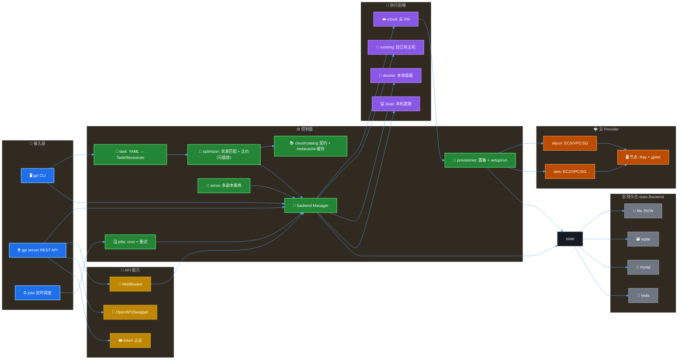
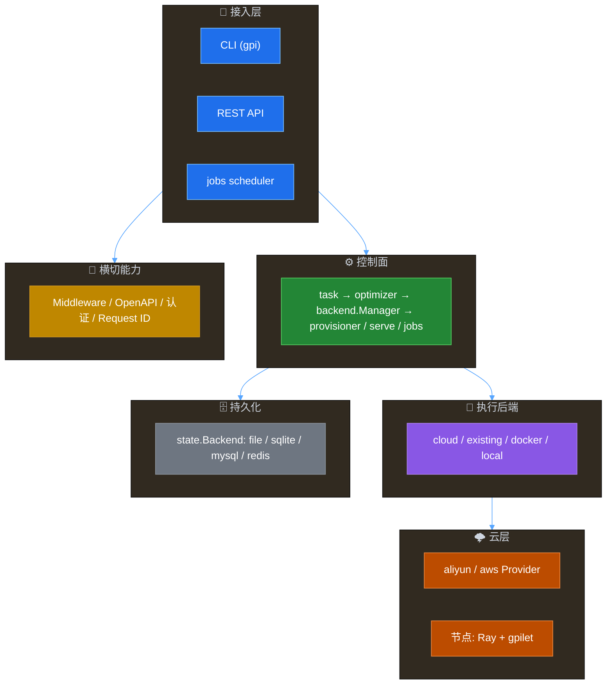

# Gpi 架构设计文档

- **文档版本**：v49（2026-08-09）
- **module**：`github.com/acmestack/gpi`
- **CLI**：`gpi`（二进制 `cmd/gpi`）
- **目标**：参考 SkyPilot 模式，用 Go 重写实现多云算力调度（multi-cloud compute scheduling），对标 SkyPilot 的 launcher / optimizer / SkyServe / Sky Jobs / API server。

## 版本记录

- **v49（2026-08-09）**：①`RunInstances` 参考 SkyPilot 改为**先 list 再复用/重启/创建**——按 cluster 名列出已有实例，running 足够直接复用、stopped（`ResumeStoppedNodes`）`StartInstances` 重启复用、否则新建（aliyun + aws，`LaunchSpec.ResumeStoppedNodes`，provisioner 默认开启）；②optimizer 包按职责拆分（plan/request/meta/registry/candidate/objective/strategy/cost/time）；③扩展指南补"Objective vs Optimizer"差异。文档升版 v49。
- **v48（2026-08-09）**：OpenAPI 在线预览路径改为 `https://acmestack.github.io/gpi/apis`——Swagger UI 三件套（index.html/swagger-initializer.js/openapi.json）移到 `docs/apis/`，`make openapi` 输出到 `docs/apis/openapi.json`。文档升版 v48。
- **v47（2026-08-09）**：OpenAPI 交互式在线预览——`docs/index.html` + `swagger-initializer.js`（Swagger UI 加载 `./openapi.json`）+ `.github/workflows/pages.yml`（GitHub Pages 发布 `docs/`），访问 `https://acmestack.github.io/gpi/apis` 即可交互查看（GitLab 内建 OpenAPI 预览，GitHub 用 Pages 等效）。文档升版 v47。
- **v46（2026-08-09）**：OpenAPI 在线查看——`cmd/gen-openapi` + `make openapi` 生成最新 `docs/openapi.json` 提交仓库，GitHub 网页直接查看，无需启动服务；K8s Deployment 默认**不开启** `--docs`（Swagger UI 不随服务暴露）。文档升版 v46。
- **v45（2026-08-09）**：新增 Kubernetes 部署资源 `deploy/k8s/`——namespace / configmap / deployment（含探针与资源限制）/ service / redis 后端 / pvc / kustomization，`kubectl apply -k deploy/k8s` 一键部署；README 增补部署到 K8s 章节。文档升版 v45。
- **v44（2026-08-09）**：①swagger 的 `taskLaunchRequest.task` 引用完整 `Task`/`Resources` schema（Swagger UI 可展开任务结构）；②docs 版本格式统一——版本记录放顶部版本号下方（降序，对齐 gpi-optimizer-extension.md），architecture 版本记录从文末迁至顶部；③修正文档与实现不一致（`/api/v1/tokens`→`/api/v1/gpi/tokens`、README 存储后端补 redis）；④新增 `aiagents/MEMORY.md` 项目沟通记录、`LICENSE`（MIT）、`.github/CLA.md`+`cla-assistant.json`（AcmeStack CLA）。文档升版 v44。
- **v43（2026-08-09）**：修复 Swagger UI 下 POST 无请求体——OpenAPI 文档是规范而非业务数据，改由 `writeRawJSON` 输出（**豁免 KeyStyle**），避免 `requestBody` 等固定键被 key-style 转换（snake 下曾变成 `request_body` 导致 UI 不显示 body）；schema 属性名统一 camelCase（`numNodes`/`useSpot` 等）与默认 API 一致。文档升版 v43。
- **v42（2026-08-09）**：REST API 前缀可自定义——默认 `/api/v1/gpi`（`GPI_API_PREFIX` 或 `--api-prefix`），swagger 直接显示完整 path（含前缀），与 server.go 路由一一对应。新增 `POST /tasks/{name}/launch`：task 以 **Task 结构体 JSON** 传入（区别于 `clusters/{name}/launch` 的 YAML 字符串），给 task 结构补 JSON tags、`Range.UnmarshalJSON`（支持 `"cpus":"8+"`）；抽取共享 `launchTask` 管道供两个 path 复用。文档升版 v42。
- **v41（2026-08-09）**：修复 KeyStyle 下的 Swagger `$ref` 断裂——`convertKeys` 现在会把 `#/components/schemas/<name>` 中的 name 同步转换为当前 key 风格（camel/snake/pascal），使 schema 组件键与 `$ref` 引用始终一致；补 `TestApplyKeyStyleRewritesSchemaRef`。默认 camel 下请求体字段为小驼峰（`numNodes`/`useSpot` 等），`--api-key-style snake|pascal` 时同步生效。文档升版 v41。
- **v40（2026-08-09）**：①`strategy.go` 的 `init` 移到文件末尾；②CI/Release workflow 增加 Docker 镜像构建（CI 构建验证，Release 推送到 GHCR `ghcr.io/<owner>/gpi`）；③文档版本号规则从各文档内移到项目根 `AGENTS.md`（docs 长期文档采用"版本号记录在内容中"约定，一次性产物仍按 `-vN-YYYYMMDD` 命名）；④Swagger 补齐请求体 schema（launch/service-up/job submit/run，含 `optimizer` 字段）。文档升版 v40。
- **v39（2026-08-09）**：time 与 cost 对称——`timeObjective` 移入 `time.go` 并新增显式 `OptimizeByTime`/`OptimizeByTimeContext`；`NewStrategy`/`ParseStrategy` 移到 `strategy.go`（策略构造归属），`objective.go` 只剩 `Objective` 接口与目标注册表。补 `TestOptimizeByTime` 验证最快首选。文档升版 v39。
- **v38（2026-08-09）**：cost 目标归属到 `cost.go`——`costObjective` 移入并新增显式入口 `OptimizeByCost`/`OptimizeByCostContext`（"按成本优化"一目了然），`Optimize`/`OptimizeWithContext` 改为其别名；补 `TestOptimizeByCost` 验证最便宜首选。文档升版 v38。
- **v37（2026-08-09）**：新增 `docs/gpi-optimizer-extension.md`——完整的 Optimizer 扩展指南：架构总览、核心类型（Candidate/Request/Options/Plan/Meta）、内置优化器与策略用法、组合式扩展（实现 `Objective` + 注册）、完全式扩展（实现 `Optimizer`）、测试注入假 Meta、演进方向与速查表。文档升版 v37。
- **v36（2026-08-09）**：优化器再收敛——`DefaultMeta` 降为未导出 `defaultMeta`，`CollectCandidates`/`AttachPrices` 管道不再导出（扩展者走 `Objective` 即可，无需复用管道）；新增导出便捷 `PricesForced`（launch 前强刷价格用），`SetDefaultMeta` 保留作测试/扩展注入。文档升版 v36。
- **v35（2026-08-09）**：优化器内部整理——`Candidate`/`CollectCandidates`/`AttachPrices` 移到 `candidate.go`（管道归属），`Objective` 接口与内置目标移到 `objective.go`，`strategy.go` 专注策略排序并为 `Optimize` 各步骤补注释。`Objective.Rank` 更名（原 `Score`，语义更直观："给候选的排名分"）。`Request.Meta` 彻底移除——元数据全局唯一走 `DefaultMeta`，测试用 `SetDefaultMeta` 注入。`RegisterObjective` 简化（直接传实例，不再传构造器）。文档升版 v35。
- **v34（2026-08-09）**：优化器**扩展 API 开放**——`Optimizer`/`Objective`/`Candidate`/`RegisterObjective`/`ParseStrategy`/`NewStrategy`/`CollectCandidates`/`AttachPrices` 全部导出，第三方可实现自定义目标（latency/carbon 等）注册进策略或直接复用候选管道（外部包测试 `optimizer_ext_test.go` 即示例）。`Request.Meta` 改为可选（空自动用 `DefaultMeta`）。**API 支持优化器/策略**：launch / service up 请求体新增 `optimizer` 字段。修复并行数组排序 bug（`sort.SliceStable` 重排 cands 但 scores 未同步，导致 cost/time 排序错乱），改用 `{candidate, scores}` 结构体一起排序 + 回归测试。文档升版 v34。
- **v33（2026-08-09）**：Optimizer 支持**两种选择模式**——指定优化器（`cost`/`time` 单目标）与指定优化策略（`--optimizer cost,time` 等逗号分隔的**字典序多目标**，参考 SkyPilot 组合优化思想，优先级任意组合/重复）。抽 `Objective` 接口（`cost`/`time`）与共享候选管道（收集+拉价预算+价格附件跑一次，仅排序键不同），`strategyOptimizer` 按目标优先级字典序排序；`Get(name)` 自动解析逗号策略名。文档升版 v33。
- **v32（2026-08-09）**：新增 `time` 优化器（参考 SkyPilot `OptimizeTarget.TIME`，`--optimizer time`）：按预估运行时长升序，输出 EST TIME 列。运行时估算：任务 `resources.time_sec` 显式指定则沿用（对标 SkyPilot `set_time_estimator`），否则按算力启发式（`est = 4h / (vcpus + GPU×16)`，基准 4 vcpu 无 GPU ≈ 1h，越强越快）；复用 cost 的候选集/价格附件与拉价预算。`Launch.EstimatedTime` + `Plan.TotalEstimatedTime` 承载展示。文档升版 v32。
- **v31（2026-08-09）**：契约与缓存运行时拆分定稿——`internal/cloud/catalog` 只保留**契约**（`Source` 接口 + `Instance`/`Price` 类型 + 注册表，对应 SkyPilot `sky/catalogs`），TTL **Cache 运行时恢复为独立的 `internal/metacache`**（重，避免 cloud/catalog 臃肿）。依赖单向：`cloud ← cloud/catalog ← metacache ← optimizer`。文档升版 v31。
- **v30（2026-08-09）**：catalog 包保留并**下沉到 `internal/cloud/catalog`**（撤销 metacache 拆分），对齐 SkyPilot 目录对应：`internal/cloud` ↔ `sky/clouds`、`internal/cloud/catalog` ↔ `sky/catalogs`、`internal/optimizer` ↔ `sky/optimizer`。catalog 自包含 `Source` 接口 + `Instance`/`Price` 类型 + 注册表 + TTL `Cache`；`cloud.Register` 类型断言自动注册元数据源。规格类型从 `InstanceSpec` 恢复为 `catalog.Instance`。文档升版 v30。
- **v29（2026-08-09）**：元数据拆包——`internal/catalog` 删除，契约并入 `internal/cloud`（`Source` 接口 + `InstanceSpec`/`Price` 类型 + `SourceFor`/`HasSource`/`SourceNames` 注册表，`cloud.Register` 自动注册），TTL 缓存运行时独立为 `internal/metacache`（`Cache`，import cloud）。依赖单向：`cloud ← metacache ← optimizer`，`cloud` 不再被元数据运行时反向依赖、无循环。规格类型更名 `InstanceSpec`（避免与运行实例 `cloud.Instance` 冲突）。文档升版 v29。
- **v28（2026-08-09）**：新云接入只需**一个 struct**。云包不再单独定义 `catalog.Source` 实现：`Provider` 结构体同时实现 `cloud.Provider` + `catalog.Source` 两组方法，`cloud.Register(p)` 用类型断言自动把满足 `catalog.Source` 的 provider 注册为元数据源（`catalog.Register`），`init()` 里只需 `cloud.Register` + `cloud.RegisterFactory`；删掉两云的 `source` struct。新增 Redis 状态后端（`GPI_STATE_BACKEND=redis`，`GPI_STATE_REDIS_ADDR/PASSWORD/DB`，go-redis/v9，每类数据一个 key：`gpi:clusters`/`gpi:services`/`gpi:jobs`/`gpi:cluster_yaml`/`gpi:cluster_history`/`gpi:cluster_events`/`gpi:config`/`gpi:tokens`，语义同 file 分文件）。新增 `Dockerfile`（多阶段构建 gpi+gpilet）+ `.dockerignore` + `make docker`。文档升版 v28。
- **v27（2026-08-09）**：Catalog 全面元数据化，删除全部静态 `xx_data.go`。每云实现 `catalog.Source`（`SpecsTTL`/`PriceTTL` 按云自定义），`catalog.Cache` TTL 缓存（规格默认 24h、价格默认 10min，stale-while-error）；`internal/pricing` 包移除，价格并入 catalog；aliyun/aws 新增 `metadata.go`（`DescribeInstanceTypes`/`DescribeInstanceTypeOfferings` 全量规格）。Optimizer 可插拔化：`optimizer.Optimizer` 接口 + 注册表 + `--optimizer` 标志，默认 `cost` 优化器参考 SkyPilot 单任务算法（候选集→打分→排序），扩展者自定义算法与 Meta。价格拉取预算化（候选截断 `maxPricedCandidates=200` + 并发 `priceWorkers=8`），无价候选排有价之后、展示与排序统一走 `Launch.CostPerHour` 回退估算。修复分页签名残留（`call` 内清理 `Signature`）。文档升版 v27。
- **v26（2026-08-08）**：聚合包生成挂在 `make build` 前置（`generate` 目标），新云建包后直接 `make build` 即自动生成并带上，无需任何单独命令；CI 走 `make build` 同样生效。文档升版 v26。
- **v25（2026-08-08）**：聚合包改为自动生成——`gen.go`（`//go:build ignore`）扫描 `internal/cloud/` 下含 `cloud.Register(` 的子包，`go generate ./internal/cloud/imports` 重写 `imports.go`；新云建包后跑一次即可，零手改 import。文档升版 v25。
- **v24（2026-08-08）**：新增聚合包 `internal/cloud/imports`，所有云空白导入集中一处；`gpi` 二进制与测试只 import 它，新云仅需在聚合包加一行。文档升版 v24。
- **v23（2026-08-08）**：云注册收敛为单一入口——每个云在 `provider.go` 的 `init()` 中一次性完成 `cloud.Register`/`cloud.RegisterFactory`/`pricing.Register`/`catalog.Register`，catalog 的 `<cloud>Catalog` 类型导出由云包注册；新增 `docs/gpi-new-cloud.md` 接入指南。文档升版 v23。
- **v22（2026-08-08）**：Catalog 改为规格静态 + 价格实时。新增 `internal/pricing`（TTL 缓存 + 惰性实时拉取，按需求触发而非定时，消除时差）；aliyun 用 `DescribePrice`+`DescribeSpotPriceHistory`，aws 用 Pricing API `GetProducts`+`DescribeSpotPriceHistory`；optimizer 排序前覆盖实时价、launch 确认前 `GetForced` 强制刷新选中最优机型，失败回退静态价。文档升版 v22。
- **v21（2026-08-08）**：全项目去重名，`gpilot → gpi`：module `github.com/acmestack/gpi`、文档 `gpi-architecture.md`/`gpi-enhancements-over-skypilot.md`、标题/描述/日志/DB/云资源名统一 `gpi`。文档升版 v21。
- **v20（2026-08-08）**：架构图升级为深色主题 + 分层配色（接入/控制面/执行/云/持久化/API 六色 classDef）与 emoji 图标。文档升版 v20。
- **v19（2026-08-08）**：重画架构图（Mermaid，含执行后端/持久化/API 能力分层）+ 更新包结构。文档升版 v19。
- **v18（2026-08-08）**：Middleware 抽象 + OpenAPI/Swagger。`server.Middleware` 接口 + `AddMiddleware` 自定义扩展（对齐 SkyPilot 中间件栈）；内置安全头/CORS/认证/request-id/日志中间件；`--docs` 提供 `/swagger.json`、`/docs`（Swagger UI）、`/redoc`。文档升版 v18。
- **v17（2026-08-08）**：补齐 `config`（KV 配置）与 `service_account_tokens`（API 令牌）两张表（对齐 SkyPilot）。新增 `--require-auth` Bearer 认证中间件（sha256 查库、支持过期/撤销/轮换）与 `gpi server token create|list|revoke|rotate`、config HTTP 端点。文档升版 v17。
- **v16（2026-08-08）**：对齐 SkyPilot 补齐集群快照/历史/事件：`cluster_yaml`（任务 YAML 快照）、`cluster_history`（启动历史）、`cluster_events`（生命周期事件，含 request_id），file/sqlite/mysql 后端均支持；`backend.Manager.Launch` 统一记录，新增 `gpi cluster yaml|history|events` 命令。文档升版 v16。
- **v15（2026-08-08）**：SQL 后端按实体拆表（`clusters`/`services`/`jobs`），参考 SkyPilot 建表方式（显式索引列 + data JSON 列），并支持旧 `gpi_state` 单表自动迁移。文档升版 v15。
- **v14（2026-08-08）**：明确平台支持为 Linux/macOS，移除 Windows 交叉编译目标（CI/release workflow 与 gpilet 构建 tag），不再提供 Windows 支持。文档升版 v14。
- **v13（2026-08-08）**：响应 key 风格可配置（camel/snake/pascal，默认小驼峰）。`GPI_API_RESPONSE_KEY_STYLE`/`--api-key-style`/`SetKeyStyle` 配置，递归作用于整个响应体所有 key。文档升版 v13。
- **v12（2026-08-08）**：新增 Request ID。每个请求带请求头则透传、否则生成；响应 header 与 body 均回写（header key 默认 `x-request-id`，`GPI_REQUEST_ID_HEADER`/`--request-id-header` 可配，body 字段默认 `request_id`）。文档升版 v12。
- **v11（2026-08-08）**：API 响应结构可定制。`server.ResponseEncoder` 接口 + 内置 raw/envelope；按 `GPI_RESPONSE_FORMAT` 或 `--response-format` 选择，字段名可配置，也支持团队自定义 Encoder。文档升版 v11。
- **v10（2026-08-08）**：新增执行后端抽象（对标 SkyPilot backend 层）。`internal/backend` 定义 `Backend` 接口 + `Manager` 分派；支持 `cloud`（默认）/`existing`（挂已有主机 SSH）/`docker`（本地容器）/`local`（本机直跑）；非 cloud 后端跳过 optimizer。文档升版 v10。
- **v9（2026-08-08）**：持久化可插拔。抽象 `state.Backend`，支持 file（默认）/sqlite/mysql 三后端，按 `GPI_STATE_BACKEND` 配置选择；sqlite/mysql 用单表 `gpi_state` 存 JSON blob。文档升版 v9。
- **v8（2026-08-08）**：新增 gpilet 节点 agent（对标 skylet）。`cmd/gpilet` + `internal/gpilet`：`gpilet serve` 常驻采集 CPU/内存/磁盘/GPU/Ray 状态写入 `/var/lib/gpilet/status.json`；Launch 自动上传并拉起；`gpi cluster nodes C --health` 读取实时健康。文档升版 v8。
- **v7（2026-08-08）**：tags 与 labels 合并。对云而言两者都是实例 key-value 标签，现统一合并写入云实例（`LaunchSpec.Tags`，顶层 `tags:` 优先）；`resources.labels:` 同时注入 Ray。文档升版 v7。
- **v6（2026-08-08）**：支持每次任务动态 AK/SK。任务顶层 `credentials:`（aws/aliyun 分块）提供专属凭据则优先使用，否则回退 env/磁盘默认加载；凭据持久化到集群状态（`state.CloudCreds`），Down/Stop/Start 复用。示例 `examples/with-credentials.yaml`。文档升版 v6。
- **v5（2026-08-08）**：支持自定义 tags 与 labels。任务顶层 `tags:` 合并进云实例标签；`resources.labels:` 注入 `ray start --labels`（head+worker），并持久化到集群状态、`gpi cluster status` 展示。文档升版 v5。
- **v4（2026-08-08）**：补齐 Ray 集群架构。`num_nodes>1` 时节点带角色 head/worker，launch 后自动 bootstrap Ray（head `ray start --head`，worker 加入）；setup 并行跑全部节点、run 在 head；新增 `gpi cluster status|nodes`、`gpi status` 展示角色统计、任务内 `{{cluster.head_ip}}/{{cluster.num_workers}}` 注入。文档升版 v4。
- **v3（2026-08-08）**：实现 AWS Provider（`internal/cloud/aws` + `internal/catalog/aws*`）。零 SDK 依赖，用标准库实现 SigV4 签名；支持 EC2 实例全生命周期、默认 VPC/新建 VPC+IGW+Route、SG、KeyPair、Ubuntu AMI 自动选择；catalog 覆盖 13 region × (t3/m5/m6i/c5 + g4dn/g5/p3/p4d)。optimizer 默认改为遍历全部已注册云做跨云比价。文档升版 v3。
- **v2（2026-08-08）**：全项目更名 `cloudpilot → cspilot`、`cpctl → csp`（含 module 路径、CLI、状态目录、环境变量、云上标签/密钥前缀、日志文件），架构文档升版 v2。
- **v1（2026-08-08）**：立项。确定范围（完整 SkyPilot 等价物）、位置（`opencode/gpi`，module `github.com/acmestack/gpi`）、CLI 名 `gpi`、首个云 aliyun、CLI+Server 双形态。完成 v1 全部功能骨架并通过测试。

---

## 1. 定位

| SkyPilot 能力 | Gpi 对应 | 说明 |
|---|---|---|
| `sky launch` / `sky exec` | `gpi launch` / `gpi exec` | 任务 YAML → 调度 → 置备 → setup/run → 日志流 |
| Optimizer（选最便宜云/region） | `internal/optimizer` | 可插拔 Optimizer 接口，默认 `cost`（参考 SkyPilot 单任务算法），基于实时元数据 + 资源匹配，输出 failover 候选排序 |
| Catalog（实例规格） | `internal/cloud/catalog` | 元数据契约（对应 `sky/catalogs`）：`Source` 接口 + `Instance`/`Price` 类型 + 注册表，无静态数据；TTL Cache 运行时在 `internal/metacache` |
| Pricing（实时价格） | `catalog.Source.FetchPrices` | 合并进 catalog 契约，价格按云 TTL 刷新（默认 10min），launch 前 `PricesForced` 强制刷新 |
| 云注册聚合 | `internal/cloud/imports` | 所有云空白导入的唯一入口，`gpi` 与测试只依赖它；由 `gen.go` 自动生成并挂在 `make build` 前置，新云构建时自动带上 |
| Cloud abstractions（`sky/clouds`） | `internal/cloud` + Provider 接口 | 一个 Provider 一个包、一个 struct 同时实现 Provider + `catalog.Source`，`cloud.Register` 自动注册元数据源；已实现 aliyun + aws |
| Cluster 生命周期 | `gpi status/start/stop/down` | 本地状态存储（对标 `~/.sky`） |
| SkyServe | `gpi serve up/status/down` | 多副本服务部署，跨 region/cloud |
| Sky Jobs + 调度 | `gpi jobs submit/status/run` | 内建 5 字段 cron + `@every/@daily` |
| HTTP API server | `gpi server start` | REST API + 后台 job scheduler |

## 2. 架构总览



## 2.1 分层视图



## 3. 包结构

```
cmd/gpi/                    # CLI 入口
cmd/gpilet/                 # 节点 agent（skylet 等价物）
internal/
  task/                     # Task/Resources 模型 + YAML 解析（Range、Accelerators、Credentials、Backend）
  cloud/catalog/            # 元数据契约（对应 sky/catalogs）：Source 接口 + 注册表（规格/价格/region）
  metacache/                # 元数据 TTL 缓存运行时（读取 catalog.Source）
  optimizer/                # Launch 候选生成：Optimizer 接口 + 注册表，默认 cost（匹配 + 成本升序 + failover）
  cloud/                    # Provider 接口 + registry
    aliyun/                 # 阿里云：轻量 RPC 签名客户端 + ECS/VPC/SG
    aws/                    # AWS：SigV4 签名客户端 + EC2/VPC/Subnet/SG
  backend/                  # 执行后端抽象：cloud / existing / docker / local + Manager 分派
  provisioner/              # launch/waitReady/runTask/exec/down/stop/start（SSH + Ray + gpilet）
  gpilet/                   # 节点指标采集（CPU/内存/磁盘/GPU/Ray）
  state/                    # clusters/services/jobs + yaml/history/events/config/tokens
  serve/                    # 多副本服务 + 端点（SkyServe 等价）
  jobs/                     # 任务注册、重试、cron 解析、调度
  server/                   # REST API + 后台 scheduler + Middleware + OpenAPI
  cli/                      # cobra 命令
```

## 4. 核心模型（internal/task）

- `Range`：支持 `4`（精确）、`8+`（下界）、`-8`（上界）、`4-8`（区间）。
- `Accelerators`：`map[string]int`，支持 `A100`、`A100:4`、`A100:4,V100`、列表、map 形式。
- `Resources`：cloud/region/zone/instance_type/cpus/memory/disk_size/accelerators/use_spot/labels。
- `Task`：name/num_nodes/resources/workdir/file_mounts/setup/run/envs/time/service。
- `ServiceSpec`：replicas/port/run/health_check 等（供 serve 使用）。

## 5. Catalog 与 Optimizer

- 实例匹配规则：instance_type 精确、cpus 精确或区间、memory 精确或区间、disk_size 下界（可满足即可）、accelerators 数量 ≥ 需求（单实例内）。
- **元数据全动态，无静态数据**：规格与价格都是"定时读取的元数据"。契约（`Source` 接口 + `Instance`/`Price` 类型 + 注册表）在 `internal/cloud/catalog`（对应 SkyPilot `sky/catalogs`），TTL 缓存运行时独立在 `internal/metacache`，供 Optimizer 与其它调用方统一读取。
- **`catalog.Source` 接口**：`Cloud()` / `SpecsTTL()` / `PriceTTL()` / `Regions(ctx)` / `FetchSpecs(ctx, region)` / `FetchPrices(ctx, region, types)`。云 provider 的 `init()` 只需 `cloud.Register(Provider{})`——`cloud.Register` 用类型断言自动把满足 `catalog.Source` 的 provider 注册为元数据源（聚合包 `internal/cloud/imports` 统一挂载）。
- **TTL 缓存策略（`metacache`）**：规格默认 24h（低价变更）、价格默认 10min，各云可在 `SpecsTTL()/PriceTTL()` 自定义。拉取失败保留旧数据不报错（stale-while-error）；`PricesForced` 绕过 TTL 强制刷新（launch 确认前用），失败有 5s 冷却。
- **Optimizer 可插拔 + 策略**：`optimizer.Optimizer` 接口（`Name()` + `Optimize(ctx, *Request) (*Plan, error)`）+ 注册表。`Request` 只含任务资源与 `Options`——**元数据全局唯一**，内部统一走未导出的 `defaultMeta`（`metacache.Cache`），测试/扩展用 `SetDefaultMeta` 注入，需要强刷价格走导出便捷 `PricesForced`。`Plan` 即 failover 顺序。扩展算法由扩展者自定义，`gpi` 只约定必要入参/出参。
- **扩展优化器（公开 API）**：`Optimizer`/`Objective`/`Candidate`/`RegisterObjective`/`ParseStrategy`/`NewStrategy`/`SetDefaultMeta` 导出。第三方只需：①实现 `Objective`（`Name()` + `Rank(c *Candidate, useSpot)`，如 latency/carbon）；②`RegisterObjective("latency", latencyObjective{})` 或 `NewStrategy(latencyObjective{}, costObjective{})`。候选收集与拉价由策略优化器内部完成，无需扩展者重复实现。optimizer 包按职责拆分：`plan.go`（Launch/Plan）、`request.go`（Options/Request）、`meta.go`（Meta 接口 + defaultMeta）、`registry.go`（Optimizer 注册表）、`candidate.go`（候选 + 管道）、`objective.go`（Objective 接口 + 注册）、`strategy.go`（策略排序）、`cost.go`（cost 目标）、`time.go`（time 目标）。参见 `optimizer_ext_test.go`（外部包测试即扩展示例）与 [gpi-optimizer-extension.md](gpi-optimizer-extension.md)（完整扩展指南）。
- **两种选择模式**：
  - **指定优化器**：`--optimizer cost|time`——单目标（cost 默认，候选集 → 按 `$/hr` 升序；time 按预估运行时长升序，输出 EST TIME 列）。
  - **指定优化策略**：`--optimizer <obj1>,<obj2>,...`——**字典序多目标**（参考 SkyPilot 组合优化思想），如 `cost,time`（先按成本、同价再看时间）、`time,cost`（先按时间、同时间再看成本），优先级可任意组合/重复。API 请求体 `optimizer` 字段同样生效（launch / service up）。
- **目标（Objective）**：`cost`（`$/hr`）与 `time`（预估运行时长）。运行时估算：任务 `resources.time_sec` 显式指定则沿用（对标 SkyPilot `set_time_estimator`），否则按实例算力启发式（`est = 4h / (vcpus + GPU×16)`，基准 4 vcpu 无 GPU ≈ 1h，越强越快）。共享候选管道（收集 + 拉价预算 + 价格附件）只跑一次，仅排序键不同。
- **价格拉取预算**：一个 region 可提供上千机型（如 aliyun cn-hangzhou ~1956）。优化器先按规格代理（vcpu 升序）预排并截断到 `maxPricedCandidates`（200），再对这批**并发**拉价（每云 `priceWorkers=8`），避免对全量候选逐个串行调 API。
- **缺价回退与排序**：候选无价（cost=0）一律排在有价候选之后，绝不冒充"最便宜"；排序与展示统一用 `Launch.CostPerHour()`——spot 模式缺价按 on-demand×0.3 估算，on-demand 模式缺价按 spot×3 估算。
- `Plan.Launches` 即 failover 顺序；可用 `--cloud`（逗号分隔）/ `-r REGION` / `--spot` / `--optimizer` 收窄候选或切换算法。未指定 `cloud` 时默认遍历**全部已注册云**做跨云比价。
- **launch 前强制刷新**：`gpi launch` 确认前对选中最优机型调用 `PricesForced` 实时刷新一次（绕过 TTL），打印最新 on-demand/spot 价供确认，避免被缓存低估。
- aliyun 元数据源：`DescribeInstanceTypes`（分页，region 全量规格）+ `DescribePrice`（按量）+ `DescribeSpotPriceHistory`（spot），价格查询并发。
- aws 元数据源：`DescribeInstanceTypes`（全局）+ `DescribeInstanceTypeOfferings`（按 region 过滤在售）+ Pricing API `GetProducts`（按量）+ EC2 `DescribeSpotPriceHistory`（spot），价格查询并发。

## 6. Cloud Provider 接口（internal/cloud）

```go
type Provider interface {
    Name() string
    Regions(ctx) ([]string, error)
    RunInstances(ctx, *LaunchSpec) ([]*Instance, error)
    ListInstances / DescribeInstances(ctx, region, ids) ([]*Instance, error)
    StopInstances / StartInstances / TerminateInstances
    GetPublicIP
    DescribeZones
    CreateKeyPair / DeleteKeyPair
    CreateSecurityGroup / AuthorizeSecurityGroup
    CreateVPC / CreateVSwitch / ListVSwitches
    GetImage(ctx, region, platform) (string, error)
}
```

Provider 若同时实现 `catalog.Source`（元数据契约，见 §5），`cloud.Register` 自动把它注册为元数据源——一个 struct 全实现，新云零额外注册。

缓存确保幂等：`RunInstances` 内部自动补齐 ImageID、SecurityGroup、VSwitch；KeyPair 由 provisioner 在本地保存私钥。**复用语义（参考 SkyPilot）**：`RunInstances` 先按 cluster 名列出已有实例——running 足够则直接复用、有 stopped（且 `ResumeStoppedNodes`）则 `StartInstances` 重启复用，否则才新建。

## 7. 阿里云 Provider 实现

- 不引入官方 SDK，用标准库实现 RPC 风格签名（HMAC-SHA1 + SHA1Base64）。
- 凭据：环境变量 `ALIBABA_CLOUD_ACCESS_KEY_ID/SECRET` 或 `~/.aliyun/config.json`。
- 端点：`ecs.aliyuncs.com`（可用 `ALIBABA_CLOUD_ENDPOINT` 覆盖）。
- 已实现：DescribeRegions/Zones/Instances、RunInstances（Amount/Spot/Tags/UserData/ClientToken）、Start/Stop/DeleteInstance、VPC/VSwitch/SG 创建与授权、CreateKeyPair、DescribeImages（按平台自动选最新 public image）。

## 7.1 AWS Provider 实现

- 不引入官方 SDK，用标准库实现 SigV4（AWS4-HMAC-SHA256）签名，Query API 直接对接 EC2。
- 凭据：环境变量 `AWS_ACCESS_KEY_ID/SECRET_ACCESS_KEY`、`AWS_REGION`；或 `~/.aws/credentials`（支持 `AWS_PROFILE`）与 `~/.aws/config` region。
- 端点：`https://ec2.{region}.amazonaws.com`。
- 已实现：DescribeRegions/AvailabilityZones/Instances（含 NextToken 分页）、RunInstances（Min/MaxCount、spot 市场、BlockDevice 磁盘、TagSpecifications、ClientToken、UserData）、Start/Stop/Terminate、VPC/IGW/RouteTable/Route/Subnet 全套创建、默认 VPC 自动复用、SG 创建与 Ingress 授权、CreateKeyPair、DescribeImages（Canonical Ubuntu AMI，按 CreationDate 取最新 x86_64）。

## 8. Provisioner 流程与 Ray 集群

1. `Launch`：确保 KeyPair → GetImage → RunInstances（UserData 写入 bootstrap）→ 写入 state（provisioning）→ 轮询至 Running 并回填 Public/Private IP → 标记节点角色。
2. **Ray bootstrap（`num_nodes>1` 时）**：head 节点安装 `ray` 并 `ray start --head`（监听 6379，dashboard 8265，以私网 IP 宣告）；各 worker 并行安装 `ray` 后 `ray start --address=<head_private_ip>:6379` 加入集群 → 状态 up。
3. **gpilet 部署**：launch 后把 `gpilet` agent 二进制上传到每个节点并拉起（`gpilet serve` 周期写 `/var/lib/gpilet/status.json`）；本地未找到 gpilet 二进制时静默跳过。`gpi cluster nodes C --health` 可经 SSH 读取实时健康。
4. 节点角色：`num_nodes=1` 单节点无角色；`num_nodes>1` 时第 1 个节点为 head(master)，其余为 worker。
5. `RunTask`：等待全部节点 SSH 可达 → 可选 rsync workdir（到 head）→ setup 在**所有节点并行**执行（多节点）→ run 在 **head** 上执行（对标 `ray exec`），行级流式输出。
6. **标签（cloud tags + Ray node labels）**：对云而言 tags 与 labels 本质相同（都是实例 key-value 标签），因此两者会**合并**后写入云实例（`LaunchSpec.Tags`，与内置 `gpi:cluster`/`gpi:cloud` 并存）；冲突时顶层 `tags:` 优先。其中 `resources.labels:` 除写入云实例外，还会以 `ray start --labels='{"k":"v"}'` 注入 head 与全部 worker，供 Ray 调度（`ray.util` 按 label 放置）使用。
7. **动态 AK/SK（credentials）**：任务 YAML 顶层 `credentials:`（按云分块 aws/aliyun）提供本次任务专属 AccessKey/Secret；若提供了则本次 launch 及后续 down/stop/start 复用该凭据，否则回退到现有 env/磁盘默认加载（`LoadCredentials`）。凭据会持久化到集群状态（`state.CloudCreds`），供生命周期操作使用。
8. `Exec`：对 head node 执行任意命令。
9. `Down/Stop/Start`：调云侧 API（复用集群创建时的凭据）并同步本地状态。

> 依赖注入：任务 `run` 内可用 `{{cluster.head_ip}}`（head 私网 IP）与 `{{cluster.num_workers}}` 拼接分布式训练参数，见 `examples/distributed-train.yaml`。凭据示例见 `examples/with-credentials.yaml`。集群状态/拓扑可用 `gpi cluster status|nodes` 查看（含 labels/tags）。

## 8.1 执行后端（internal/backend）

对标 SkyPilot 的 backend 层：抽象"任务怎么跑"，而非"状态存哪"。`backend.Backend` 接口定义 Launch/RunTask/Exec/Down/Stop/Start；`backend.Manager` 在 launch 时按 `task.Backend` 选择后端，并把后端名持久化到集群，后续生命周期按 `cluster.Backend` 分派。

| backend | 说明 | 任务 YAML | 生命周期 |
|---|---|---|---|
| `cloud`（默认） | 云 VM + Ray/gpilet（原 provisioner） | 无 | 全支持 |
| `existing` | 挂已有主机，SSH 执行 setup/run，不置备 | `ssh: {host, user, key, port}` | down=仅删记录；stop/start 不支持 |
| `docker` | 本地 Docker 容器执行 | `docker: {image, volumes, envs, gpus}` | down=删容器；stop/start=停/启容器 |
| `local` | 本机直接执行 setup/run | 无 | down=仅删记录；stop/start 不支持 |

- 非 cloud 后端不经过 optimizer（无 placement），`gpi launch` 直接执行。
- 示例：`examples/existing-cluster.yaml`、`examples/docker-task.yaml`、`examples/local-task.yaml`。

## 9. 状态存储（internal/state）

- 可插拔持久化后端，按配置选择：**file**（默认）、**sqlite**、**mysql**、**redis**。
- 抽象为 `state.Backend` 接口（Load/Save/Close），`Store` 内存缓存 + 每次变更全量写回。
- 配置（环境变量）：
  - `GPI_STATE_BACKEND`：`file` | `sqlite` | `mysql` | `redis`（默认 `file`）
  - `GPI_STATE_SQLITE`：sqlite 数据库路径（默认 `$GPI_HOME/gpi.db`）
  - `GPI_STATE_MYSQL_DSN`：MySQL 数据源，如 `user:pass@tcp(host:3306)/gpi`
  - `GPI_STATE_REDIS_ADDR`：Redis 地址（默认 `localhost:6379`）
  - `GPI_STATE_REDIS_PASSWORD`：Redis 密码（可选）
  - `GPI_STATE_REDIS_DB`：Redis 逻辑库（默认 0）
- **file**：每类数据一个 JSON 文件，原子写（tmp+rename），默认 `~/.gpi/`（`GPI_HOME` 可覆盖）：
  - `state.json`（clusters）、`state-services.json`、`state-jobs.json`、`state-cluster-yaml.json`、`state-cluster-history.json`、`state-cluster-events.json`、`state-config.json`、`state-tokens.json`
- **redis**：每类数据一个 key（`gpi:clusters`/`gpi:services`/`gpi:jobs`/`gpi:cluster_yaml`/`gpi:cluster_history`/`gpi:cluster_events`/`gpi:config`/`gpi:tokens`），JSON blob，SET/GET 原子写，语义同 file 的分文件。
- **sqlite / mysql**：每个实体一张表，参考 SkyPilot 的按实体建表方式：
  - `clusters`（name PK，status/backend/cloud/region/num_nodes/task_yaml 显式列 + data JSON 列）
  - `services`、`jobs` 同理（显式索引列 + data JSON 列）
  - `cluster_yaml`：每个集群的 task YAML 快照（launch 时写入）
  - `cluster_history`：集群启动历史（num_nodes/cloud/region/instance_type/backend/launched_at）
  - `cluster_events`：生命周期事件（from/to/type/reason/request_id/transitioned_at），对齐 SkyPilot cluster_events
  - `config`：KV 运行时配置（对齐 SkyPilot config 表）
  - `service_account_tokens`：API 访问令牌（token_hash 唯一索引、过期、撤销/轮换），对齐 SkyPilot service_account_tokens
  - 旧版单表 `gpi_state` 数据会在首次打开时自动迁移到新表并删除旧表。
- 记录入口统一在 `backend.Manager.Launch`（yaml+history+launch event）；`Down/Stop/Start` 写入事件。查看：`gpi cluster yaml|history|events C`。
- **API 认证**：`gpi server start --require-auth` 开启后，除 `/healthz` 与 `POST /api/v1/gpi/tokens`（引导首个 token）外，所有请求须携带 `Authorization: Bearer <token>`；服务端按 sha256 查 `service_account_tokens` 校验有效/未过期/未撤销。token 管理：`gpi server token create|list|revoke|rotate`。

## 11.4 Middleware 与 OpenAPI（Swagger）

- **Middleware 抽象**：`server.Middleware` 接口（`Wrap(next http.Handler) http.Handler`），`Server.AddMiddleware(...)` 注册自定义中间件（最外层执行，先于内置链）。对标 SkyPilot 的 FastAPI 中间件栈，便于各团队扩展定制（认证/限流/追踪/埋点等）。
- **内置中间件**（顺序：自定义 → 安全头 → CORS → 认证 → request-id → 日志）：
  - `securityHeaders`：`X-Content-Type-Options`/`X-Frame-Options`/`Referrer-Policy`
  - `cors`：`--enable-cors` 开启，permissive 头
  - `auth`：`--require-auth` 开启 Bearer 认证
  - `requestID`：request-id 透传/生成（默认 `x-request-id`）
  - `logging`：请求方法/路径/耗时
- **OpenAPI/Swagger**：`--docs` 开启后提供：
  - `GET /swagger.json`：OpenAPI 3.0 规范（14 条路径 + launch/service-up/job/task 请求体 schema，含 `optimizer` 字段）
  - `GET /docs`：Swagger UI
  - `GET /redoc`：ReDoc
  - docs 端点公开（不要求 token），方便查看接口文档。
- **在线查看（推荐）**：最新 OpenAPI 规范已提交到仓库 `docs/apis/openapi.json`（`make openapi` 重新生成）。GitHub 只对 JSON 高亮、不渲染 OpenAPI，故用 **GitHub Pages + Swagger UI** 提供交互式预览：`docs/apis/index.html` 加载 `swagger-initializer.js` 指向 `./openapi.json`，`.github/workflows/pages.yml` 在 `docs/**` 变更时发布，访问 `https://<owner>.github.io/gpi/apis`。K8s Deployment 默认不开启 `--docs`。

## 10. 命令参考（gpi）

| 命令 | 说明 | 对标 |
|---|---|---|
| `gpi launch T.yaml [-c NAME] [--spot] [--optimizer cost|time|cost,time] [-y]` | 调度 + 置备 + 运行任务（多节点自动组 Ray 集群） | `sky launch` |
| `gpi optimize T.yaml [--optimizer cost|time|cost,time]` | 只打印 placement plan（支持策略，如 `cost,time`） | optimizer dry-run |
| `gpi status` | 集群列表（含 head/worker 角色统计） | `sky status` |
| `gpi cluster status\|nodes C` | 集群拓扑与节点角色明细 | `ray status` 等价 |
| `gpi exec C -- CMD` | 在 head 上执行任意命令 | `sky exec` |
| `gpi down/stop/start C` | 生命周期 | `sky down/stop/start` |
| `gpi serve up S.yaml` / `status` / `down` | 服务部署 | `sky serve up/status/down` |
| `gpi jobs submit T.yaml --schedule "0 0 * * *" --retries 3` | 注册任务 | `sky jobs launch` |
| `gpi jobs status` / `run` | 查看/立即执行 | `sky jobs` |
| `gpi server start --port 8080` | REST API + 调度器 | sky server |

## 11. HTTP API（gpi server）

所有 REST 路由以 API 前缀开头，**默认 `/api/v1/gpi`**，可自定义：`GPI_API_PREFIX` 环境变量或 `gpi server start --api-prefix <prefix>`。下方表格展示默认前缀下的完整路径。

| 方法 | 路径 | 说明 |
|---|---|---|
| GET | `/healthz` | 健康检查 |
| GET | `/api/v1/gpi/clusters` | 集群列表 |
| GET | `/api/v1/gpi/clusters/{name}` | 集群详情 |
| POST | `/api/v1/gpi/clusters/{name}/launch` | 调度 + 置备（task 为 **YAML 字符串**，dry_run / run_task / optimizer） |
| DELETE | `/api/v1/gpi/clusters/{name}` | 销毁 |
| POST | `/api/v1/gpi/tasks/{name}/launch` | 调度 + 置备（task 为 **Task 结构体 JSON**，与上方 path 区分） |
| GET | `/api/v1/gpi/services` | 服务列表 |
| POST | `/api/v1/gpi/services/up` | 部署服务（支持 optimizer） |
| DELETE | `/api/v1/gpi/services/{name}` | 拆除服务 |
| GET | `/api/v1/gpi/jobs` | 任务列表 |
| POST | `/api/v1/gpi/jobs` | 注册任务 |
| POST | `/api/v1/gpi/jobs/{name}/run` | 立即执行 |

后台 scheduler 每 10s 扫描一次到期任务（由 cron 解析得出 NextRun），执行成功/失败后重新计算下次触发时间。

`POST /api/v1/gpi/clusters/{name}/launch` 与 `POST /api/v1/gpi/services/up` 请求体支持 `optimizer` 字段（`cost`/`time`/`cost,time` 等），空默认 `cost`，与 CLI `--optimizer` 语义一致。

**task 的两种输入方式**：
- `clusters/{name}/launch`：请求体 `task` 为 **YAML 字符串**（兼容 task 文件内容）。
- `tasks/{name}/launch`：请求体 `task` 为 **Task 结构体 JSON**（结构化字段，如 `{"name":..,"num_nodes":..,"resources":{"accelerators":{"A100":1},"cpus":"8+"},"run":".."}`），`task` 必填。

### 11.1 可定制响应结构（ResponseEncoder）

不同团队对 API 响应包装有差异要求，通过 `ResponseEncoder` 接口统一收口，`Server` 默认按环境变量选择：

- **配置**：环境变量 `GPI_RESPONSE_FORMAT=raw|envelope`，或 `gpi server start --response-format raw|envelope`。
- **raw（默认）**：成功原样返回数据，错误返回 `{"error":"..."}`。
- **envelope**：统一包装为 `{"code":<http>,"message":"ok|err","data":<payload>}`；字段名可通过 `EnvelopeConfig` 自定义。
- **完全自定义**：实现 `ResponseEncoder` 接口（`EncodeSuccess/EncodeError`）后 `Server.SetResponseEncoder(...)` 注册，即可输出任意团队约定的结构（如 `{"success":true,"result":...}`）。

### 11.2 Request ID

每个请求分配一个 request ID 用于全链路追踪：

- **来源**：请求头若带上游 request ID（如经其他网关/服务转发）则原样透传；否则生成 32 位十六进制随机 ID。
- **回写**：响应 header 与 body 均携带该 ID（header 与 body 值一致）。
- **header key**：默认 `x-request-id`，可通过 `GPI_REQUEST_ID_HEADER` 环境变量或 `gpi server start --request-id-header` 自定义为任意合法 HTTP header key。
- **body 字段名**：默认 `request_id`（`Server.RequestIDBodyField` 可改）。body 为对象时直接注入字段，为数组等其他形态时包装为 `{"request_id":..., "data":...}`。
- 与 `ResponseEncoder` 正交：无论 raw/envelope/自定义 Encoder，request_id 都会注入。

### 11.3 响应 key 风格（KeyStyle）

响应 JSON 的 key 命名风格可配置，默认**小驼峰（camelCase）**：

- 三种风格：`camel`（`numNodes`，默认）、`snake`（`num_nodes`）、`pascal`（`NumNodes`）。
- 配置：环境变量 `GPI_API_RESPONSE_KEY_STYLE`，或 `gpi server start --api-key-style camel|snake|pascal`，或 `Server.SetKeyStyle(...)`。
- 作用于整个响应体所有 key（结构体字段、envelope 字段、request_id 等），递归生效；仅改变线上 JSON 格式，handler 与内部结构不变。
- 示例（envelope + 默认 camel）：`{"code":200,"message":"ok","data":[...],"requestId":"..."}`；snake 下 `request_id`；pascal 下 `RequestId`。

## 12. 依赖

- CLI：`github.com/spf13/cobra` + `gopkg.in/yaml.v3`。
- 存储：`modernc.org/sqlite`（纯 Go sqlite）、`github.com/go-sql-driver/mysql`、`github.com/redis/go-redis/v9`。
- 云侧、SSH、HTTP 全部走标准库（aliyun/aws 均自研签名）。
- 测试：`github.com/alicebob/miniredis/v2`（纯 Go 内存 Redis）。
- Go 版本要求 ≥ 1.22（`net/http` 路由模式）。
- **容器化**：`Dockerfile` 多阶段构建（golang 构建 + scratch 运行），产出 `gpi` 与 `gpilet` 两个二进制；`make docker` 一键构建 `gpi:latest`。**Kubernetes 部署**：`deploy/k8s/` 提供 namespace/configmap/deployment/service/redis 后端/PVC 等资源，`kubectl apply -k deploy/k8s` 一键部署（详见 [deploy/k8s/README.md](../../deploy/k8s/README.md)）；镜像由 Release workflow 推送 `ghcr.io/acmestack/gpi`。

## 13. 已知限制与后续路线

- aliyun + aws 两个 Provider，cloud/catalog 契约 + metacache 全量元数据（规格/价格实时拉取 + TTL 缓存）；后续：GPU 内存变体匹配、多实例拆卡（A100:8 跨节点）、spot 竞价格上限、SkyServe 的自动伸缩/健康轮询、job 日志持久化。
- 多节点已支持 head/worker Ray 集群（setup 全员、run 在 head）；后续可补：节点间 SG 精确放行、`ray attach`/端口转发、GPU 资源规格上报。
- 安全组默认放行 `0.0.0.0/0:22` 与 `1024-65535`，生产需收敛。
- **平台支持**：仅支持 Linux 与 macOS（gpilet 依赖 `syscall.Statfs` 等 Unix API，`disk_unix.go` 限定 `linux || darwin`）；不提供 Windows 支持。

---

